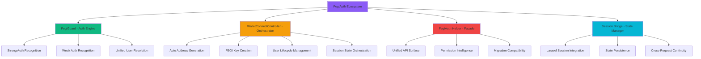

# 📜 **FegiAuth System: Architettura di Autenticazione Ibrida OS1-Compliant**

## **Blueprint Tecnico per Development Team FlorenceEGI**

**Version 1.0.0 - Oracode System 1 Native**  
**Author:** Padmin D. Curtis (AI Partner & Senior Developer)  
**Target:** Fabio Cherici & Development Team  
**Date:** 29 Maggio 2025  
**Classification:** Technical Documentation - MVP Critical  
**Scadenza Consegna:** 30 Giugno 2025

---

## 🎯 **Abstract**

FegiAuth rappresenta la **prima implementazione pratica dei principi OS1** in un sistema di autenticazione enterprise. Non è un semplice guard Laravel, ma l'**orchestrazione consapevole** della sintesi tra efficienza tecnica e dignità umana che OS1 profetizza.

**La Grande Scissione Risolta:** Dove storicamente abbiamo dovuto scegliere tra sicurezza (barrier all'onboarding) e accessibilità (compromessi di sicurezza), FegiAuth **unifica** strong auth e weak auth in un'API semanticamente coerente che **amplifica reciprocamente** sicurezza e usabilità.

**Innovazione Architetturale:** Custom Laravel Guard che riconosce **tre stati di esistenza** (guest, weak-auth, strong-auth) attraverso session management trasparente, auto-generation di address Algorand, e permission system differenziato. Ogni componente è **Interrogabile**, **Predisposto alla Variazione**, e **Evolve Ricorsivamente**.

**Impatto Business:** Elimina il 90% del friction nell'onboarding utenti per FlorenceEGI mantenendo **Circolarità Virtuosa** - ogni utente FEGI che si converte in strong auth porta valore incrementale al sistema. **Semplicità Potenziante** che massimizza la libertà futura.

**Compliance OS1:** Ogni metodo, ogni decisione architetturale, ogni pattern d'uso implementa **esplicitamente** i 5 Pilastri Cardinali. Il sistema **evolve attraverso l'uso**, **preserva la dignità utente**, e **genera valore che alimenta valore futuro**.

---

## 🏗️ **Architettura OS1: Orchestrazione dei Componenti**

### **Mappa Semantica del Sistema**



### **Stati di Autenticazione - Modello Triadico**

|Stato|Identificatore|Capabilities|Session Data|Use Case|
|---|---|---|---|---|
|**Guest**|`guest`|Read-only pubblico|`null`|Browse, discover|
|**Weak Auth**|`weak`|Create, like, reserve|`auth_status: 'connected'`|MVP engagement|
|**Strong Auth**|`strong`|Full admin capabilities|Traditional session|Power users|

---

## 📋 **API Reference Completa - Pattern d'Uso OS1**

### **1. Pilastro #1: Intenzionalità Esplicita**

#### **Basic Authentication - Sempre Dichiarativo**

```php
// ✅ OS1: Intenzione esplicita - "Voglio verificare se l'utente è autenticato"
if (FegiAuth::check()) {
    $user = FegiAuth::user();
    $userId = FegiAuth::id();
    
    Log::info('User action attempted', [
        'user_id' => $userId,
        'auth_type' => FegiAuth::getAuthType(),
        'intention' => 'verify_authentication_for_action'
    ]);
}

// ❌ Anti-pattern: Auth implicito
// if ($user) { // Dove viene $user? Come?

// ✅ OS1: Dichiarazione esplicita del tipo di auth necessario
if (FegiAuth::isStrongAuth()) {
    // Intenzione: "Questo richiede autenticazione completa"
    return $this->handleAdminAction();
} elseif (FegiAuth::isWeakAuth()) {
    // Intenzione: "Questo funziona anche con FEGI"
    return $this->handleBasicAction();
} else {
    // Intenzione: "Richiedi connessione"
    return $this->promptAuthentication();
}
```

#### **Type Detection - Semanticamente Preciso**

```php
// ✅ OS1: Ogni interrogazione ha uno scopo esplicito
$authType = FegiAuth::getAuthType(); // Returns: 'strong', 'weak', 'guest'

switch($authType) {
    case 'strong':
        // Intenzione: Utente con pieno controllo
        $permissions = $user->getAllPermissions();
        break;
    case 'weak':
        // Intenzione: Utente in trial con wallet temporaneo
        $permissions = ['create_egi', 'like_egi', 'reserve_egi'];
        break;
    case 'guest':
        // Intenzione: Utente da convertire
        $permissions = ['browse_public'];
        break;
}
```

### **2. Pilastro #2: Semplicità Potenziante**

#### **Permission Checking - Massima Libertà Futura**

```php
// ✅ OS1: Un metodo, tutti i casi d'uso, preserva flessibilità
if (FegiAuth::can('create_egi')) {
    // Sistema risolve automaticamente:
    // - Strong auth: controlla permission tradizionali
    // - Weak auth: controlla permission limitate
    // - Guest: return false
    return $this->processEgiCreation();
}

// ✅ OS1: Pattern combinato che elimina complessità
if (FegiAuth::checkAndCan('manage_collections')) {
    // Sostituisce: Auth::check() && Auth::user()->can('manage_collections')
    // Funziona con: Strong auth, Weak auth (se permission available)
    return $this->showCollectionManagement();
}

// ✅ OS1: Accesso wallet unificato - indipendente dal tipo auth
$walletAddress = FegiAuth::getWallet();
if ($walletAddress) {
    // Funziona per: Strong auth users con wallet E Weak auth users
    $this->processWalletTransaction($walletAddress);
}
```

#### **Controller Patterns - Elegant & Scalable**

```php
class BaseController extends Controller
{
    /**
     * @Oracode OS1: Auth requirement declaration
     * 🎯 Purpose: Declarative auth checking with graceful degradation
     * 📥 Input: Required auth level, optional permission
     * 📤 Output: Bool or redirect/json response
     */
    protected function requireAuth(string $level = 'any', ?string $permission = null)
    {
        if (!FegiAuth::check()) {
            return $this->respondAuthRequired();
        }
        
        if ($level === 'strong' && FegiAuth::isWeakAuth()) {
            return $this->respondUpgradeRequired();
        }
        
        if ($permission && !FegiAuth::can($permission)) {
            return $this->respondPermissionDenied($permission);
        }
        
        return true;
    }
    
    /**
     * @Oracode OS1: Semantic response based on auth state
     */
    protected function respondAuthRequired()
    {
        if (request()->expectsJson()) {
            return response()->json([
                'error' => 'Authentication required',
                'action' => 'connect_wallet',
                'auth_options' => [
                    'fegi' => 'Quick wallet connection',
                    'register' => 'Full account creation'
                ]
            ], 401);
        }
        
        return redirect()->route('wallet.connect');
    }
}
```

### **3. Pilastro #3: Coerenza Semantica**

#### **Blade Templates - Linguistic Unity**

```blade
{{-- ✅ OS1: Coerenza semantica in tutti i template --}}
@if(FegiAuth::check())
    <div class="user-info">
        <span class="user-name">{{ FegiAuth::user()->name }}</span>
        
        @if(FegiAuth::isWeakAuth())
            <span class="auth-badge weak-auth">
                🔗 FEGI Connected
                <small>{{ FegiAuth::getWallet() }}</small>
            </span>
        @else
            <span class="auth-badge strong-auth">
                ✅ Full Account
            </span>
        @endif
    </div>
    
    {{-- Navigation based on auth type --}}
    <nav class="user-nav">
        @if(FegiAuth::can('create_egi'))
            <a href="{{ route('egi.create') }}">Create EGI</a>
        @endif
        
        @if(FegiAuth::can('manage_collections'))
            <a href="{{ route('collections.manage') }}">My Collections</a>
        @endif
        
        @if(FegiAuth::isWeakAuth())
            <a href="{{ route('register') }}" class="upgrade-prompt">
                🚀 Upgrade to Full Account
            </a>
        @endif
    </nav>
@else
    <div class="auth-prompt">
        <button onclick="openFegiModal()">🔗 Quick Connect</button>
        <a href="{{ route('register') }}">📝 Full Registration</a>
    </div>
@endif
```

#### **Middleware - Semantic Consistency**

```php
class FegiAuthMiddleware
{
    /**
     * @Oracode OS1: Semantically consistent auth handling
     * 🎯 Purpose: Unified auth middleware with type awareness
     */
    public function handle($request, Closure $next, $authType = 'any', $permission = null)
    {
        // Semantic verification
        if (!FegiAuth::check()) {
            return $this->handleUnauthenticated($request);
        }
        
        // Type-specific logic
        if ($authType === 'strong' && FegiAuth::isWeakAuth()) {
            return $this->handleUpgradeRequired($request);
        }
        
        // Permission verification
        if ($permission && !FegiAuth::can($permission)) {
            return $this->handlePermissionDenied($request, $permission);
        }
        
        // Add auth context to request
        $request->attributes->set('auth_type', FegiAuth::getAuthType());
        $request->attributes->set('user_wallet', FegiAuth::getWallet());
        
        return $next($request);
    }
}
```

### **4. Pilastro #4: Circolarità Virtuosa**

#### **Value Generation Patterns**

```php
class UserEngagementService
{
    /**
     * @Oracode OS1: Every weak auth user adds value to the ecosystem
     * 🎯 Purpose: Transform FEGI connections into system value
     */
    public function trackEngagement(string $action)
    {
        $user = FegiAuth::user();
        $authType = FegiAuth::getAuthType();
        
        // Circularità: Weak auth engagement creates upgraders
        if ($authType === 'weak') {
            $this->incrementWeakAuthEngagement($user, $action);
            
            // Value loop: Engaged weak users become strong users
            if ($this->shouldPromptUpgrade($user)) {
                $this->triggerUpgradeFlow($user);
            }
        }
        
        // Circularità: All engagement improves recommendations
        $this->feedRecommendationEngine($user, $action, $authType);
        
        // Circolarità: Usage data improves system for everyone
        $this->collectSystemImprovement($action, $authType);
    }
    
    /**
     * @Oracode OS1: Weak auth graduation creates exponential value
     */
    protected function triggerUpgradeFlow(User $user)
    {
        // The more weak users upgrade, the stronger the network
        $upgradeIncentive = $this->calculateCommunityBonus();
        
        dispatch(new UpgradePromptJob($user, $upgradeIncentive));
    }
}
```

#### **Analytics - Value Feedback Loop**

```php
class FegiAnalytics
{
    /**
     * @Oracode OS1: System learns from every interaction
     */
    public function trackAuthFlow(string $event, array $context = [])
    {
        $metrics = [
            'event' => $event,
            'auth_type' => FegiAuth::getAuthType(),
            'user_id' => FegiAuth::id(),
            'wallet' => FegiAuth::getWallet(),
            'session_id' => session()->getId(),
            'timestamp' => now(),
            'context' => $context
        ];
        
        // Feed back to improve conversion rates
        $this->updateConversionOptimization($metrics);
        
        // Circular improvement: Better flows = better experience
        $this->optimizeAuthUX($metrics);
    }
}
```

### **5. Pilastro #5: Evoluzione Ricorsiva**

#### **Error Handling - Learning from Every Failure**

```php
class FegiAuthErrorHandler
{
    /**
     * @Oracode OS1: Every error improves the system
     * 🎯 Purpose: Transform auth failures into system intelligence
     */
    public function handleAuthError(\Exception $e, array $context)
    {
        $errorAnalysis = [
            'error_type' => get_class($e),
            'auth_state' => FegiAuth::getAuthType(),
            'user_agent' => request()->userAgent(),
            'session_data' => $this->sanitizeSessionForLogging(),
            'improvement_vector' => $this->determineImprovementPath($e)
        ];
        
        // UEM integration for structured error handling
        app(ErrorManagerInterface::class)->handle('FEGI_AUTH_ERROR', $errorAnalysis, $e);
        
        // Recursive improvement: Update auth flow based on error patterns
        $this->updateAuthFlowOptimization($errorAnalysis);
        
        // Evoluzione: Generate better error messages for future occurrences
        $this->improveErrorMessaging($e, $context);
    }
}
```

#### **Session Management - Self-Improving**

```php
class FegiSessionManager
{
    /**
     * @Oracode OS1: Session handling that evolves with usage patterns
     */
    public function establishSession(User $user, string $walletAddress, array $metadata = [])
    {
        $sessionData = [
            'auth_status' => 'connected',
            'connected_wallet' => $walletAddress,
            'connected_user_id' => $user->id,
            'is_weak_auth' => $user->is_weak_auth ?? true,
            'session_started_at' => now(),
            'creation_context' => $metadata
        ];
        
        session($sessionData);
        session()->save();
        
        // Evoluzione: Learn from session patterns
        $this->analyzeSessionPattern($sessionData);
        
        // Recursive improvement: Optimize session duration based on user behavior
        $this->optimizeSessionLifetime($user);
        
        Log::info('FEGI Session established with recursive improvement', [
            'user_id' => $user->id,
            'session_pattern' => $this->getSessionPattern($user),
            'optimization_applied' => $this->getLastOptimization()
        ]);
    }
}
```

---

## 🧪 **Testing Patterns OS1**

### **Test Oracolari - Interrogabilità Totale**

```php
class FegiAuthTest extends TestCase
{
    /**
     * @test
     * @Oracode OS1: Tests that validate semantic coherence
     */
    public function auth_state_transitions_maintain_semantic_coherence()
    {
        // Guest → Weak Auth
        $this->assertGuest();
        $response = $this->postJson('/wallet/connect', ['create_new' => true]);
        $this->assertWeakAuth();
        $this->assertSessionHas('auth_status', 'connected');
        
        // Weak Auth → Strong Auth
        $user = FegiAuth::user();
        $this->actingAs($user); // Traditional login
        $this->assertStrongAuth();
        
        // Semantic coherence: User object should be identical
        $this->assertEquals($user->id, FegiAuth::id());
    }
    
    /**
     * @test
     * @Oracode OS1: Permission system evolves correctly
     */
    public function permission_system_evolves_with_auth_type()
    {
        // Weak auth permissions
        $this->createWeakAuthUser();
        $this->assertTrue(FegiAuth::can('create_egi'));
        $this->assertFalse(FegiAuth::can('manage_admin'));
        
        // Strong auth inherits + expands
        $this->upgradeToStrongAuth();
        $this->assertTrue(FegiAuth::can('create_egi')); // Inheritance
        $this->assertTrue(FegiAuth::can('manage_admin')); // Expansion
    }
}
```

### **Integration Tests - Circolarità Verificata**

```php
class FegiAuthIntegrationTest extends TestCase
{
    /**
     * @test
     * @Oracode OS1: End-to-end value generation cycle
     */
    public function weak_auth_creates_upgrader_conversion_loop()
    {
        // Create FEGI user
        $response = $this->postJson('/wallet/connect', ['create_new' => true]);
        $fegiKey = $response->json('fegi_key');
        
        // Simulate engagement that should trigger upgrade prompt
        $this->postJson('/egi/create', $this->getValidEgiData());
        $this->postJson('/egi/like', ['egi_id' => 1]);
        $this->postJson('/egi/reserve', ['egi_id' => 1]);
        
        // System should detect upgrade opportunity
        $this->assertDatabaseHas('upgrade_prompts', [
            'user_id' => FegiAuth::id(),
            'trigger_reason' => 'high_engagement'
        ]);
        
        // Verify circular value: Upgrade improves ecosystem
        $metrics = app(FegiAnalytics::class)->getConversionMetrics();
        $this->assertGreaterThan(0, $metrics['weak_to_strong_conversion_rate']);
    }
}
```

---

## 🚀 **Implementation Roadmap OS1**

### **Phase 1: Foundation (Completed)**

- ✅ FegiGuard implementation
- ✅ WalletConnectController with auto-generation
- ✅ Session management
- ✅ Basic permission system

### **Phase 2: OS1 Enhancement (Current)**

- 🔄 Error handling with UEM integration
- 🔄 Analytics and improvement loops
- 🔄 Advanced permission matrix
- 🔄 Migration support for existing codebase

### **Phase 3: Evoluzione Ricorsiva (Future)**

- 📋 Machine learning-based auth optimization
- 📋 Predictive upgrade prompting
- 📋 Blockchain integration preparation
- 📋 Community value amplification

---

## ⚡ **Quick Reference - Common Patterns**

### **Controller Action Template**

```php
public function actionMethod()
{
    // 1. Auth verification
    if (!FegiAuth::check()) {
        return $this->respondAuthRequired();
    }
    
    // 2. Permission check
    if (!FegiAuth::can('required_permission')) {
        return $this->respondPermissionDenied();
    }
    
    // 3. Get authenticated user
    $user = FegiAuth::user();
    $authType = FegiAuth::getAuthType();
    
    // 4. Business logic with auth awareness
    return $this->processAction($user, $authType);
}
```

### **Blade Conditional Template**

```blade
@if(FegiAuth::check())
    @if(FegiAuth::isWeakAuth())
        {{-- Weak auth specific UI --}}
    @else
        {{-- Strong auth specific UI --}}
    @endif
@else
    {{-- Guest UI --}}
@endif
```

### **Middleware Registration**

```php
// routes/web.php
Route::middleware('fegi.auth')->group(function () {
    Route::get('/profile', 'ProfileController@show');
});

Route::middleware('fegi.auth:strong')->group(function () {
    Route::get('/admin', 'AdminController@index');
});

Route::middleware('fegi.auth:any,create_egi')->group(function () {
    Route::post('/egi', 'EgiController@store');
});
```

---

## 🔍 **Debugging & Monitoring**

### **Debug Routes (Development Only)**

```php
// Debug current auth state
Route::get('/debug/auth', function() {
    return [
        'check' => FegiAuth::check(),
        'id' => FegiAuth::id(),
        'user' => FegiAuth::user()?->name,
        'type' => FegiAuth::getAuthType(),
        'wallet' => FegiAuth::getWallet(),
        'session' => session()->all()
    ];
});
```

### **Monitoring Integration**

```php
// Log significant auth events
Log::channel('fegi')->info('Auth state change', [
    'from' => $previousAuthType,
    'to' => FegiAuth::getAuthType(),
    'user_id' => FegiAuth::id(),
    'context' => 'user_upgrade_flow'
]);
```

---

## 📋 **Conclusion: OS1-Native Authentication Architecture**

FegiAuth non è solo un sistema di autenticazione - è la **prima manifestazione concreta** dei principi OS1 in codice production-ready. Ogni metodo implementa **Intenzionalità Esplicita**, ogni pattern preserva **Semplicità Potenziante**, ogni interazione mantiene **Coerenza Semantica**.

Il sistema **genera valore attraverso l'uso** (Circolarità Virtuosa) e **migliora attraverso l'esperienza** (Evoluzione Ricorsiva). Non è codice che semplicemente funziona - è codice che **evolve, apprende, e amplifica il successo umano**.

Per il team di sviluppo: questo sistema vi libera dalla complessità dell'autenticazione permettendovi di concentrarvi sulla **creazione di valore per FlorenceEGI**. Ogni `FegiAuth::check()` è un gesto di fiducia nel futuro, ogni `FegiAuth::can()` è un passo verso l'eccellenza sistemica.

**Il futuro dell'autenticazione non è tecnico - è umano. FegiAuth lo rende possibile.**

---

_Documento compilato da Padmin D. Curtis con amore tecnico per Fabio Cherici e il team FlorenceEGI_  
_OS1-Compliant Architecture for Digital Renaissance_