# 📜 **FlorenceEGI Registration - Developer Flow Map**

**Version:** 2.0.0 OS1-Compliant  
**Date:** December 2024  
**Authors:** Padmin D. Curtis, Fabio Cherici  
**Target:** Development Team  
**Purpose:** Exact WHO-WHAT-WHERE flow with code references and visual diagrams

---


## 🎯 **Quick Navigation for Developers**

```
🔍 Need to debug registration? Start here:
├── Frontend issues → Section A: Client-Side Flow
├── Server validation → Section B: Laravel Processing  
├── Collection setup → Section C: Post-Registration Services
├── Error handling → Section D: Error Scenarios
└── Performance → Section E: Monitoring Points
```

**Key Files to Have Open:**
- `resources/views/auth/register.blade.php` (lines 200-600: JavaScript logic)
- `app/Http/Controllers/Auth/RegisterController.php` 
- `app/Services/CollectionService.php` (method: `findOrCreateUserCollection`)
- `Ultra/EgiModule/Services/UserRoleService.php` (method: `assignCreatorRole`)

---

# 📊 **MASTER FLOW DIAGRAM**

```mermaid
flowchart TD
    Start([User clicks Register]) --> LoadPage[register.blade.php loads]
    LoadPage --> DOMReady{DOM Ready?}
    DOMReady -->|Yes| InitJS[JavaScript initialization]
    DOMReady -->|No| Wait[Wait for DOM]
    Wait --> DOMReady
    
    InitJS --> UserInteraction[User fills form]
    UserInteraction --> Submit{User clicks Submit}
    
    Submit --> ClientValidation[Client validation]
    ClientValidation -->|Pass| SendRequest[POST to /register]
    ClientValidation -->|Fail| ShowErrors[Display errors]
    ShowErrors --> UserInteraction
    
    SendRequest --> LaravelReceive[RegisterController@register]
    LaravelReceive --> ServerValidation[Laravel validation]
    ServerValidation -->|Fail| ReturnErrors[Return with errors]
    ServerValidation -->|Pass| CreateUser[User::create]
    
    CreateUser --> AuthLogin[Auth::login]
    AuthLogin --> CreateCollection[CollectionService call]
    CreateCollection --> AssignRole[UserRoleService call]
    AssignRole --> AttachWallet[WalletService call]
    AttachWallet --> Redirect[Redirect to dashboard]
    
    ReturnErrors --> DisplayErrors[Show validation errors]
    DisplayErrors --> UserInteraction
    
    Redirect --> Success([User in dashboard])
    
    style Start fill:#e1f5fe
    style Success fill:#c8e6c9
    style ShowErrors fill:#ffcdd2
    style DisplayErrors fill:#ffcdd2
```

---

# 🔥 **SECTION A: CLIENT-SIDE FLOW**

## **A1: Page Load & JavaScript Initialization**

### **File: `register.blade.php` (Lines 200-250)**

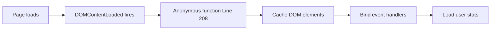

**Exact Code Location:**
```javascript
// File: register.blade.php, Line 208
document.addEventListener('DOMContentLoaded', function() {
    // Lines 212-218: Element caching
    const form = document.getElementById('registration-form');
    const submitButton = document.getElementById('submit-button');
    const progressBar = document.getElementById('form-progress');
    
    // Lines 220-245: Event binding
    function updateProgress() { /* Line 225 */ }
    // ...rest of initialization
});
```

**What Variables Exist at This Point:**
- `form`: HTMLFormElement (registration-form)
- `submitButton`: HTMLButtonElement (submit-button)  
- `progressBar`: HTMLDivElement (form-progress)
- `formProgress`: Number (0)

---

## **A2: User Type Selection**

### **File: `register.blade.php` (Lines 260-285)**

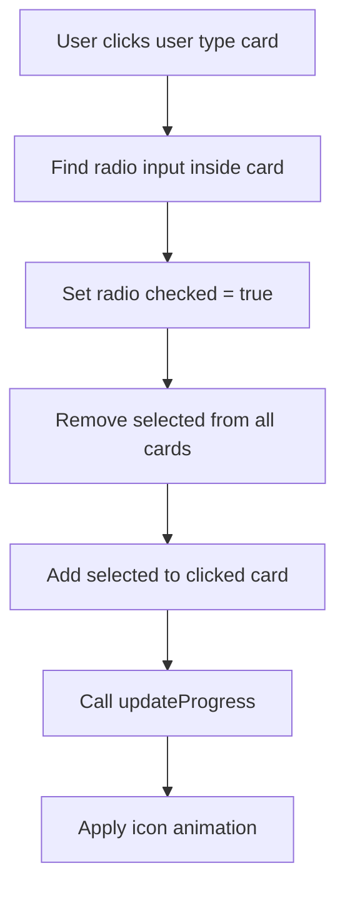

**Exact Code Location:**
```javascript
// File: register.blade.php, Lines 260-285
const userTypeInputs = document.querySelectorAll('input[name="user_type"]');
const userTypeCards = document.querySelectorAll('label[data-user-type]');

userTypeInputs.forEach(input => {
    input.addEventListener('change', function() {  // Line 264
        userTypeCards.forEach(card => {
            card.classList.remove('selected');     // Line 268
        });
        if (this.checked) {
            this.closest('label[data-user-type]').classList.add('selected'); // Line 270
            updateProgress();                      // Line 272
        }
    });
});
```

**Variables State After This Step:**
- `selectedUserType`: String (creator/mecenate/acquirente/azienda/epp_entity)
- `formProgress`: Number (+20%)

---

## **A3: Real-Time Field Validation**

### **Password Strength Calculation**

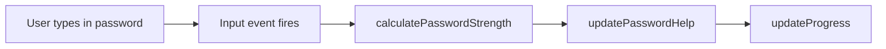

**File: `register.blade.php` (Lines 320-365)**

```javascript
// Line 320: Password strength calculator
function calculatePasswordStrength(password) {
    let strength = 0;
    
    // Lines 324-325: Length checks
    if (password.length >= 8) strength++;
    if (password.length >= 12) strength++;
    
    // Lines 328-331: Character variety
    if (/[a-z]/.test(password)) strength++;     // Line 328
    if (/[A-Z]/.test(password)) strength++;     // Line 329  
    if (/[0-9]/.test(password)) strength++;     // Line 330
    if (/[^A-Za-z0-9]/.test(password)) strength++; // Line 331
    
    return Math.min(strength, 5);              // Line 333
}

// Line 340: Visual feedback update
function updatePasswordHelp(helpElement, strengthBar, strength, length) {
    const messages = ['', 'Password molto debole', 'Password debole', /* ... */]; // Line 341
    const classes = ['', 'weak', 'weak', 'fair', 'good', 'strong', 'strong'];   // Line 342
    
    // Lines 350-360: Apply visual feedback
    helpElement.textContent = messages[strength];
    strengthBar.className = `password-strength ${classes[strength]}`;
}
```

**DOM Elements Modified:**
- `#password-strength-bar`: CSS class changes
- `#password-help`: text content updates
- `#form-progress`: width percentage updates

---

## **A4: Form Submission Process**

### **Client-Side Validation**

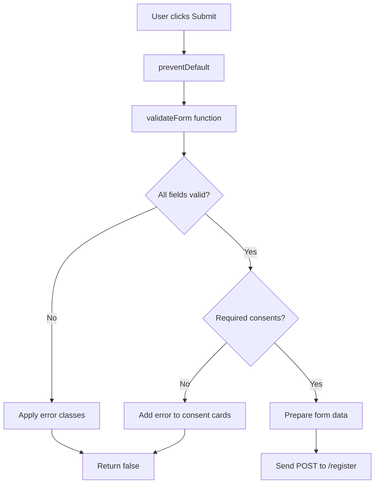

**File: `register.blade.php` (Lines 420-485)**

```javascript
// Line 420: Form submission handler
form.addEventListener('submit', function(e) {
    e.preventDefault();                    // Line 421
    
    let hasErrors = false;                 // Line 422
    
    // Lines 425-440: Required consents validation
    requiredConsents.forEach(input => {
        const card = input.closest('.consent-card');
        if (!input.checked) {              // Line 428
            hasErrors = true;
            if (card) card.classList.add('error'); // Line 430
        } else {
            if (card) card.classList.remove('error');
        }
    });
    
    // Lines 442-455: Password validation
    const password = passwordInput.value;
    const confirmation = passwordConfirmation.value;
    if (password !== confirmation) {       // Line 445
        hasErrors = true;
        passwordConfirmation.classList.add('error');
    }
    
    // Lines 458-465: Email validation
    const email = emailInput.value;
    const emailRegex = /^[^\s@]+@[^\s@]+\.[^\s@]+$/;
    if (!emailRegex.test(email)) {         // Line 460
        hasErrors = true;
        emailInput.classList.add('error');
    }
    
    if (hasErrors) {
        // Lines 470-480: Error handling
        const firstError = document.querySelector('.consent-card.error, .input-rinascimento.error');
        if (firstError) {
            firstError.scrollIntoView({    // Line 473
                behavior: 'smooth',
                block: 'center'
            });
        }
        return false;                      // Line 480
    }
    
    // Line 485: Success - continue to server submission
});
```

**Variables State During Validation:**
- `hasErrors`: Boolean (tracks validation state)
- `password`: String (current password value)
- `confirmation`: String (password confirmation value)
- `email`: String (current email value)

---

# 🔥 **SECTION B: LARAVEL PROCESSING**

## **B1: Request Reception & Routing**

### **Route Resolution**

```mermaid
flowchart LR
    BrowserPOST[Browser POST /register] --> LaravelRouter[Laravel Router]
    LaravelRouter --> Middleware[Middleware Stack]
    Middleware --> CSRF[VerifyCsrfToken]
    CSRF --> SessionStart[StartSession]
    SessionStart --> Controller[RegisterController@register]
```

**File: `routes/web.php`**
```php
// Default Laravel auth routes
Auth::routes();
// Resolves to: POST /register -> Auth\RegisterController@register
```

**File: `app/Http/Controllers/Auth/RegisterController.php`**
```php
// Method called: register(Request $request)
public function register(Request $request)
{
    $this->validator($request->all())->validate();     // Line ~65
    
    event(new Registered($user = $this->create($request->all()))); // Line ~67
    
    $this->guard()->login($user);                      // Line ~69
    
    return $this->registered($request, $user)          // Line ~71
        ?: redirect($this->redirectPath());
}
```

---

## **B2: Server-Side Validation**

### **Validation Rules Applied**

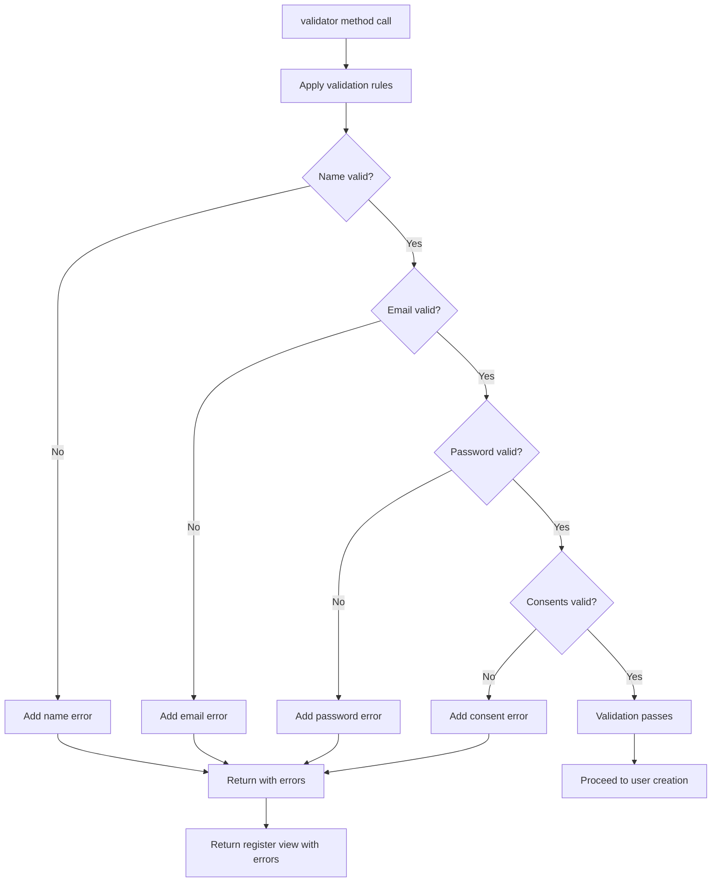

**File: `app/Http/Controllers/Auth/RegisterController.php` (Lines 50-70)**

```php
protected function validator(array $data)
{
    return Validator::make($data, [
        'name' => ['required', 'string', 'max:255', 'min:2'],                    // Line 52
        'email' => ['required', 'string', 'email', 'max:255', 'unique:users'],   // Line 53
        'password' => ['required', 'string', 'min:8', 'confirmed'],              // Line 54
        'user_type' => ['required', 'in:creator,mecenate,acquirente,azienda,epp_entity'], // Line 55
        'privacy_policy_accepted' => ['required', 'accepted'],                   // Line 56
        'terms_accepted' => ['required', 'accepted'],                           // Line 57
        'age_confirmation' => ['required', 'accepted'],                         // Line 58
        'consents.*' => ['sometimes', 'boolean'],                               // Line 59 (optional)
    ]);
}
```

**If Validation Fails:**
- Laravel returns to `register.blade.php` with error bag
- `@error('field_name')` directives display errors  
- `old('field_name')` preserves form values
- User sees form with errors highlighted

---

## **B3: User Creation**

### **Database Transaction**

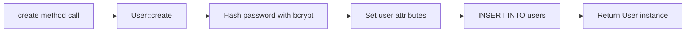

**File: `app/Http/Controllers/Auth/RegisterController.php` (Lines 75-90)**

```php
protected function create(array $data)
{
    return User::create([
        'name' => $data['name'],                           // Line 77
        'email' => $data['email'],                         // Line 78
        'email_verified_at' => null,                       // Line 79
        'password' => Hash::make($data['password']),       // Line 80
        'usertype' => $data['usertype'],                 // Line 81
        'privacy_policy_accepted_at' => now(),             // Line 82
        'terms_accepted_at' => now(),                      // Line 83
        'age_confirmed_at' => now(),                       // Line 84
        'marketing_consent' => $data['consents']['marketing'] ?? false,    // Line 85
        'analytics_consent' => $data['consents']['analytics'] ?? false,    // Line 86
        'profiling_consent' => $data['consents']['profiling'] ?? false,    // Line 87
    ]);
}
```

**Database State After User Creation:**
- New row in `users` table
- `id`: Auto-incremented primary key
- `password`: Bcrypt hashed
- `created_at`, `updated_at`: Current timestamp

---

## **B4: Authentication & Session Setup**

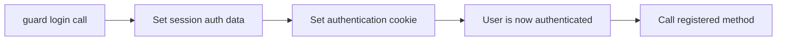

**Laravel Internal Process:**
```php
// Laravel's Auth::login() process
$this->guard()->login($user);   // Sets session data:
// $_SESSION['login_web_' . sha1('App\User')] = $user->id
// Sets remember_token if "remember me" was checked
```

**Session Data Set:**
- Authentication identifier stored
- User ID accessible via `Auth::id()`
- User model accessible via `Auth::user()`

---

# 🔥 **SECTION C: POST-REGISTRATION SERVICES**

## **C1: Collection Service Flow**

### **File: `app/Services/CollectionService.php` (Method: `findOrCreateUserCollection`)**

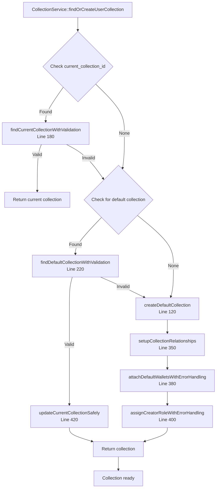

**Exact Code Execution:**

```php
// File: app/Services/CollectionService.php, Line 110
public function findOrCreateUserCollection(User $user, array $logContext = []): Collection|JsonResponse
{
    $enhancedLogContext = array_merge($logContext, [
        'creator_id' => $user->id,                        // Line 113
        'operation' => 'find_or_create_user_collection',  // Line 114
        'service' => static::class                        // Line 115
    ]);

    $this->logger->info('[CollectionService] Starting collection lookup', $enhancedLogContext); // Line 117

    try {
        // Step 1: Try current collection
        $currentCollection = $this->findCurrentCollectionWithValidation($user, $enhancedLogContext); // Line 120
        if ($currentCollection) {
            return $currentCollection;                    // Line 125
        }

        // Step 2: Try default collection  
        $defaultCollection = $this->findDefaultCollectionWithValidation($user, $enhancedLogContext); // Line 128
        if ($defaultCollection) {
            $this->updateCurrentCollectionSafely($user, $defaultCollection, $enhancedLogContext); // Line 130
            return $defaultCollection;                    // Line 135
        }

        // Step 3: Create new collection
        $newCollection = $this->createDefaultCollection($user); // Line 138
        
        if ($newCollection instanceof JsonResponse) {
            return $newCollection;                        // Line 142 (error case)
        }

        $this->updateCurrentCollectionSafely($user, $newCollection, $enhancedLogContext); // Line 145
        return $newCollection;                           // Line 148

    } catch (Throwable $e) {
        // Error handling with UEM
        return $this->errorManager->handle('COLLECTION_FIND_CREATE_FAILED', $errorContext, $e); // Line 155
    }
}
```

**Variables State During Execution:**
- `$user`: User model instance (newly created)
- `$enhancedLogContext`: Array with logging context
- `$currentCollection`: Collection|null 
- `$defaultCollection`: Collection|null
- `$newCollection`: Collection|JsonResponse

---

## **C2: User Role Service Flow**

### **File: `Ultra/EgiModule/Services/UserRoleService.php` (Method: `assignCreatorRole`)**

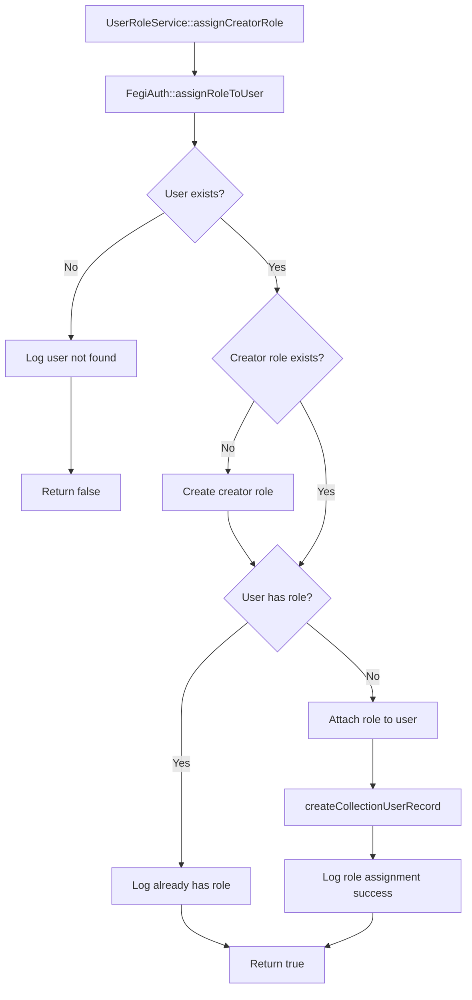

**Exact Code Execution:**

```php
// File: Ultra/EgiModule/Services/UserRoleService.php, Line 65
public function assignCreatorRole(int $userId): bool
{
    $context = [
        'user_id' => $userId,                             // Line 67
        'role' => 'creator'                               // Line 68
    ];

    try {
        $result = FegiAuth::assignRoleToUser($userId, 'creator'); // Line 71

        if ($result) {
            $this->logger->info('Creator role assigned to user', $context); // Line 74
        } else {
            $this->logger->error('User not found or role assignment failed', $context); // Line 76
            $this->errorManager->handle('ROLE_ASSIGNMENT_FAILED', $context, null, false); // Line 77
        }

        return $result;                                   // Line 80

    } catch (Throwable $e) {
        $this->logger->error('Error during role assignment', array_merge($context, [
            'error_message' => $e->getMessage(),          // Line 84
            'error_class' => get_class($e)                // Line 85
        ]));
        $this->errorManager->handle('ROLE_ASSIGNMENT_FAILED', /* ... */, $e, false); // Line 87
        return false;                                     // Line 90
    }
}
```

### **Collection-User Pivot Record Creation**

```php
// File: UserRoleService.php, Line 200
public function createCollectionUserRecord(
    int $userId,
    int $collectionId,
    string $role = 'creator'
): bool {
    $context = [
        'user_id' => $userId,                             // Line 207
        'collection_id' => $collectionId,                 // Line 208
        'role' => $role,                                  // Line 209
    ];

    try {
        // Check for existing record
        $existingRecord = CollectionUser::where('user_id', $userId)
            ->where('collection_id', $collectionId)      // Line 215
            ->first();                                    // Line 216

        if ($existingRecord) {
            return $this->updateExistingCollectionUserRecord(/* ... */); // Line 220
        }

        // Create new record
        $recordData = [
            'user_id' => $userId,                         // Line 225
            'collection_id' => $collectionId,             // Line 226
            'role' => $role,                              // Line 227
            'is_owner' => $role === 'creator',            // Line 228
            'joined_at' => now(),                         // Line 229
            'metadata' => [/* ... */],                    // Line 230
            'status' => 'active'                          // Line 235
        ];

        $collectionUser = CollectionUser::create($recordData); // Line 238

        return true;                                      // Line 245

    } catch (Throwable $e) {
        $this->errorManager->handle('COLLECTION_USER_CREATION_FAILED', $context, $e, false); // Line 250
        return false;                                     // Line 252
    }
}
```

**Database Changes:**
- New row in `collection_users` table
- Spatie `model_has_roles` table updated
- User's `current_collection_id` updated

---

# 🔥 **SECTION D: ERROR HANDLING FLOWS**

## **D1: Client-Side Error Scenarios**

### **Validation Error Flow**

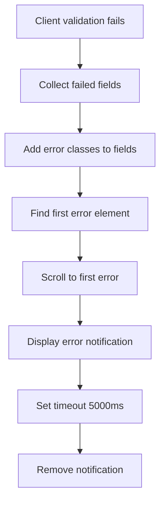

**File: `register.blade.php` (Lines 470-490)**
```javascript
if (hasErrors) {
    // Line 472: Scroll to first error
    const firstError = document.querySelector('.consent-card.error, .input-rinascimento.error');
    if (firstError) {
        firstError.scrollIntoView({                       // Line 475
            behavior: 'smooth',
            block: 'center'
        });
    }

    // Line 480: Show error notification
    const errorMessage = document.createElement('div');
    errorMessage.className = 'fixed top-4 right-4 bg-rosso-urgenza text-white px-4 py-2 rounded-lg shadow-lg z-50 fade-in'; // Line 481
    errorMessage.textContent = 'Per favore correggi gli errori evidenziati'; // Line 482
    document.body.appendChild(errorMessage);              // Line 483

    setTimeout(() => {
        errorMessage.remove();                            // Line 486
    }, 5000);

    return false;                                         // Line 490
}
```

---

## **D2: Server-Side Error Scenarios**

### **UEM Error Handling Integration**

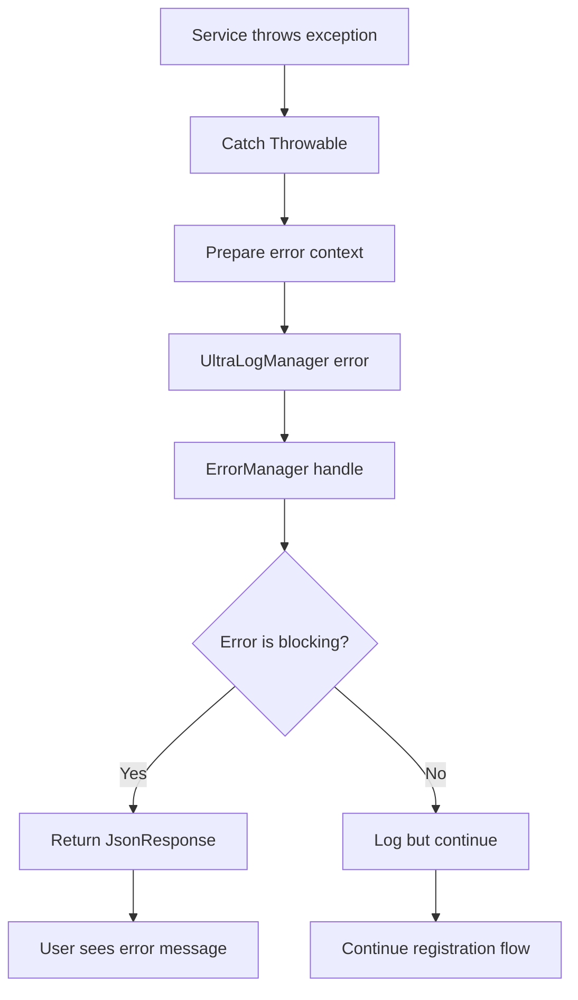

**File: `app/Services/CollectionService.php` (Lines 150-170)**
```php
} catch (Throwable $e) {
    $errorContext = array_merge($enhancedLogContext, [
        'error_message' => $e->getMessage(),              // Line 152
        'error_class' => get_class($e),                   // Line 153
        'error_file' => $e->getFile(),                    // Line 154
        'error_line' => $e->getLine()                     // Line 155
    ]);

    $this->logger->error('[CollectionService] Error during collection find/create operation', $errorContext); // Line 157

    return $this->errorManager->handle('COLLECTION_FIND_CREATE_FAILED', $errorContext, $e); // Line 159
}
```

**UEM Error Codes Defined:**
- `COLLECTION_CREATION_FAILED`: Collection creation database error
- `ROLE_ASSIGNMENT_FAILED`: User role assignment error  
- `COLLECTION_USER_CREATION_FAILED`: Pivot table creation error
- `WALLET_ATTACHMENT_FAILED`: Wallet service error

---

# 🔥 **SECTION E: MONITORING & DEBUG POINTS**

## **E1: Key Debug Breakpoints**

### **Frontend Debug Points**

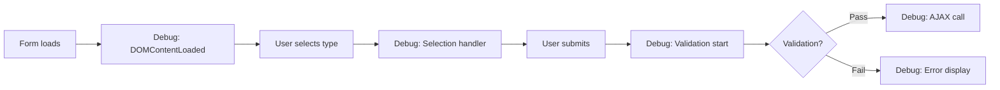

**Breakpoint Instructions:**
```javascript
// File: register.blade.php
// 🔍 Debug Point 1 (Line 208): Check initialization
console.log('Form elements:', { form, submitButton, progressBar });

// 🔍 Debug Point 2 (Line 270): Check user type selection  
console.log('User type selected:', this.value, 'Card:', this.closest('label'));

// 🔍 Debug Point 3 (Line 425): Check validation start
console.log('Starting validation, hasErrors:', hasErrors);

// 🔍 Debug Point 4 (Line 485): Check form data before submit
console.log('Form data being sent:', new FormData(form));

// 🔍 Debug Point 5 (Line 475): Check error display
console.log('First error element:', firstError, 'Errors found:', document.querySelectorAll('.error'));
```

### **Backend Debug Points**

```mermaid
flowchart LR
    LaravelReceive[Request received] --> DebugPoint1[Debug: RegisterController start]
    DebugPoint1 --> Validation[Validation] --> DebugPoint2[Debug: Validation rules applied]
    DebugPoint2 --> UserCreate[User creation] --> DebugPoint3[Debug: User create called]
    DebugPoint3 --> Collections[Collection service] --> DebugPoint4[Debug: CollectionService call]
    DebugPoint4 --> Roles[Role assignment] --> DebugPoint5[Debug: UserRoleService call]
```

**Debug Instructions:**
```php
// 🔍 Debug Point 1: RegisterController@register (Line 65)
Log::info('Registration started', ['request_data' => $request->all()]);

// 🔍 Debug Point 2: Validation (Line 52-59)  
Log::info('Validation rules applied', ['rules' => $this->validator($request->all())->getRules()]);

// 🔍 Debug Point 3: User creation (Line 77-87)
Log::info('Creating user', ['user_data' => $userData]);

// 🔍 Debug Point 4: Collection service (Line 113)
Log::info('CollectionService called', ['user_id' => $user->id, 'context' => $logContext]);

// 🔍 Debug Point 5: Role service (Line 67) 
Log::info('UserRoleService called', ['user_id' => $userId, 'role' => 'creator']);
```

---

## **E2: Performance Monitoring Points**

### **Metrics to Track**

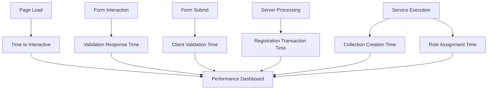

**Frontend Performance Tracking:**
```javascript
// File: register.blade.php, Lines 500-520
const performanceTracker = {
    formStartTime: performance.now(),
    
    trackValidation() {
        const validationTime = performance.now() - this.validationStartTime;
        console.log(`Validation took ${validationTime}ms`);
    },
    
    trackSubmission() {
        const submissionTime = performance.now() - this.formStartTime;
        console.log(`Total form interaction time: ${submissionTime}ms`);
    }
};
```

**Backend Performance Tracking:**
```php
// File: RegisterController.php, Method: register
$startTime = microtime(true);

// ... registration logic ...

$processingTime = microtime(true) - $startTime;
Log::info('Registration completed', [
    'processing_time_ms' => $processingTime * 1000,
    'user_id' => $user->id
]);
```

---

# 🎯 **DEVELOPER QUICK REFERENCE**

## **Most Common Debug Scenarios**

### **🚨 "Form not submitting"**
1. Check: Line 208 - DOMContentLoaded fired?
2. Check: Line 425 - validateForm() called?  
3. Check: Line 480 - hasErrors = true?
4. Check: Browser console for JavaScript errors

### **🚨 "Validation errors not showing"**
1. Check: Laravel validation rules (RegisterController lines 52-59)
2. Check: `@error` directives in register.blade.php 
3. Check: `old()` values preserved
4. Check: Session flash data

### **🚨 "User created but no collection"**
1. Check: CollectionService::findOrCreateUserCollection called
2. Check: UEM logs for COLLECTION_CREATION_FAILED
3. Check: Database permissions on collections table
4. Check: User's current_collection_id value

### **🚨 "User has no creator role"**
1. Check: UserRoleService::assignCreatorRole called
2. Check: Spatie permissions setup
3. Check: model_has_roles table for entry
4. Check: UEM logs for ROLE_ASSIGNMENT_FAILED

---

## **File-by-File Ownership Map**

| Component | File | Key Methods/Lines |
|-----------|------|-------------------|
| **Form UI** | `register.blade.php` | Lines 200-600 (JavaScript) |
| **Validation** | `RegisterController.php` | `validator()` (52-59), `create()` (77-87) |
| **Collections** | `CollectionService.php` | `findOrCreateUserCollection()` (110-160) |
| **Roles** | `UserRoleService.php` | `assignCreatorRole()` (65-90) |
| **Error Handling** | UEM integration | Throughout all services |

**This documentation ensures developers can find the exact code location for any part of the registration flow and follow the precise execution path.**

---

**🎯 NEXT STEPS FOR DEVELOPERS:**

1. **Open the key files** listed in Quick Navigation
2. **Set breakpoints** at the debug points marked with 🔍 
3. **Follow the Mermaid diagrams** to understand flow
4. **Use the exact line numbers** provided for quick code location
5. **Check UEM logs** for error patterns and service issues