# 📜 **Create Collection Modal - Developer Flow Map**

**Version:** 2.0.0 OS1-Compliant  
**Date:** December 2024  
**Authors:** Padmin D. Curtis, Fabio Cherici  
**Target:** Development Team  
**Purpose:** Exact WHO-WHAT-WHERE flow from modal trigger to collection creation

---

## 🎯 **Quick Navigation for Developers**

```
🔍 Need to debug modal? Start here:
├── Modal not opening → Section A: Modal Initialization & Triggers
├── Validation issues → Section B: Real-Time Validation Flow  
├── Form submission → Section C: AJAX Submission Process
├── Server processing → Section D: Laravel Backend Flow
├── Error handling → Section E: Error Scenarios
└── Context behavior → Section F: Guest vs Dashboard Context
```

**Key Files to Have Open:**
- `resources/js/components/create-collection-modal.js` (lines 50-200: core logic)
- `resources/views/components/create-collection-modal.blade.php` (modal template)
- `resources/js/components/create-collection-modal-context.js` (context detection)
- `app/Http/Controllers/CollectionsController.php` (method: `create`)
- `app/Services/CollectionService.php` (method: `createDefaultCollection`)

---

# 📊 **MASTER FLOW DIAGRAM**

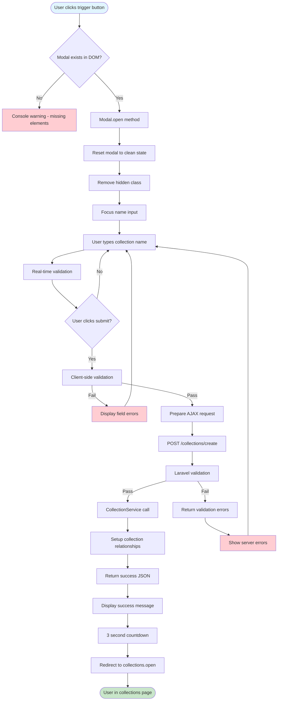

---

# 🔥 **SECTION A: MODAL INITIALIZATION & TRIGGERS**

## **A1: JavaScript Class Initialization**

### **File: `create-collection-modal.js` (Lines 20-70)**

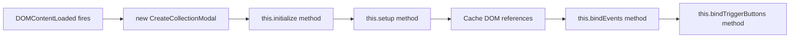

**Exact Code Location:**
```javascript
// File: create-collection-modal.js, Line 20
class CreateCollectionModal {
    constructor() {
        // Lines 22-35: Property initialization
        this.modal = null;
        this.modalContainer = null;
        this.form = null;
        this.nameInput = null;
        this.submitButton = null;
        this.isOpen = false;
        this.isSubmitting = false;
        
        // Line 36: Single initialization entry point
        this.initialize();
    }
    
    // Line 45: Initialize modal system
    initialize() {
        if (document.readyState === 'loading') {
            document.addEventListener('DOMContentLoaded', () => this.setup()); // Line 47
        } else {
            this.setup(); // Line 49
        }
    }
}
```

**Variables State After Initialization:**
- `this.modal`: HTMLElement (create-collection-modal)
- `this.form`: HTMLFormElement (create-collection-form)  
- `this.nameInput`: HTMLInputElement (collection_name)
- `this.submitButton`: HTMLButtonElement (submit-create-collection)
- `this.isOpen`: Boolean (false)

---

## **A2: Trigger Button Binding**

### **File: `create-collection-modal.js` (Lines 120-145)**

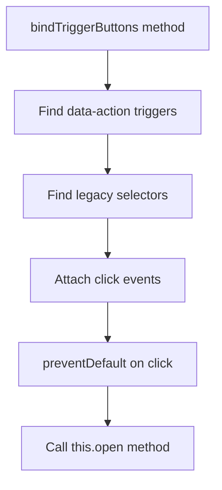

**Exact Code Location:**
```javascript
// File: create-collection-modal.js, Lines 120-145
bindTriggerButtons() {
    // Line 122: Generic trigger selector for flexibility
    const triggers = document.querySelectorAll('[data-action="open-create-collection-modal"]');

    triggers.forEach(trigger => {
        trigger.addEventListener('click', (e) => {  // Line 125
            e.preventDefault();                    // Line 126
            this.open();                          // Line 127
        });
    });

    // Line 131: Legacy support for existing buttons
    const legacyTriggers = document.querySelectorAll('.create-collection-trigger, #create-collection-button');
    legacyTriggers.forEach(trigger => {
        trigger.addEventListener('click', (e) => { // Line 134
            e.preventDefault();                    // Line 135
            this.open();                          // Line 136
        });
    });
}
```

**Supported Trigger Patterns:**
- `<button data-action="open-create-collection-modal">Create</button>`
- `<button class="create-collection-trigger">Create</button>`
- `<button id="create-collection-button">Create</button>`

---

## **A3: Modal Opening Process**

### **File: `create-collection-modal.js` (Lines 150-185)**

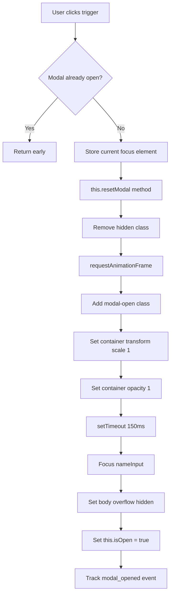

**Exact Code Location:**
```javascript
// File: create-collection-modal.js, Lines 150-185
open() {
    if (this.isOpen) return;                      // Line 151

    try {
        // Line 154: Store current focus for restoration
        this.focusedElementBeforeModal = document.activeElement;

        // Line 157: Reset modal to clean state
        this.resetModal();

        // Line 160: Smooth modal appearance
        this.modal.classList.remove('hidden');    // Line 161
        this.modal.setAttribute('aria-hidden', 'false'); // Line 162

        // Line 164: Trigger transition after DOM update
        requestAnimationFrame(() => {
            this.modal.classList.add('modal-open'); // Line 166
            this.modalContainer.style.transform = 'scale(1)'; // Line 167
            this.modalContainer.style.opacity = '1'; // Line 168
        });

        // Line 171: Focus management
        setTimeout(() => {
            this.nameInput.focus();               // Line 173
        }, 150);

        // Line 176: Body scroll prevention
        document.body.style.overflow = 'hidden'; // Line 177

        this.isOpen = true;                       // Line 179

        // Line 182: Analytics tracking
        this.trackEvent('modal_opened');          // Line 183

    } catch (error) {
        console.error('[CreateCollectionModal] Open failed:', error); // Line 185
    }
}
```

**DOM State After Opening:**
- Modal: `class` includes `modal-open`, `aria-hidden="false"`
- Container: `transform: scale(1)`, `opacity: 1`
- Body: `overflow: hidden`
- Focus: On `#collection_name` input

---

# 🔥 **SECTION B: REAL-TIME VALIDATION FLOW**

## **B1: Input Event Handling**

### **File: `create-collection-modal.js` (Lines 320-350)**

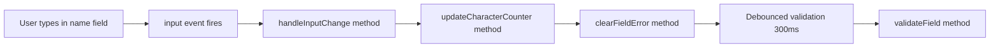

**Exact Code Location:**
```javascript
// File: create-collection-modal.js, Lines 320-350
bindEvents() {
    // Line 322: Real-time character counter and validation
    this.nameInput.addEventListener('input', () => this.handleInputChange()); // Line 323
    this.nameInput.addEventListener('blur', () => this.validateField());      // Line 324

    // Line 326: Debounced validation
    this.nameInput.addEventListener('input', () => {
        clearTimeout(this.validationTimeout);               // Line 328
        this.validationTimeout = setTimeout(() => this.validateField(), 300); // Line 329
    });
}

// Line 335: Handle input changes with character counter
handleInputChange() {
    this.updateCharacterCounter();                          // Line 337

    // Line 339: Clear validation error while typing
    this.clearFieldError('collection_name');               // Line 340
}
```

**Variables State During Input:**
- `this.validationTimeout`: Number (timeout ID)
- Input value: String (current name value)
- Character count: Number (0-100)

---

## **B2: Character Counter Update**

### **File: `create-collection-modal.js` (Lines 380-410)**

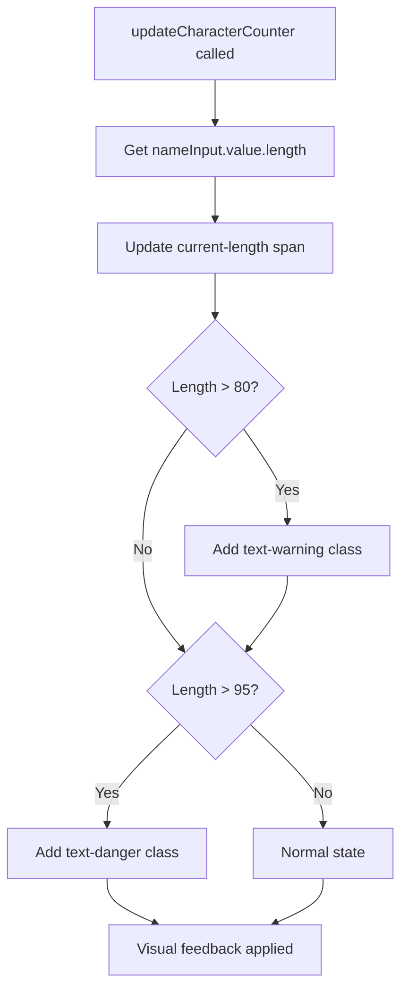

**Exact Code Location:**
```javascript
// File: create-collection-modal.js, Lines 380-410
updateCharacterCounter() {
    const currentLength = this.nameInput.value.length;     // Line 382
    const maxLength = 100;                                 // Line 383
    const counter = document.getElementById('character-counter'); // Line 384
    const currentSpan = document.getElementById('current-length'); // Line 385

    if (currentSpan) {
        currentSpan.textContent = currentLength;           // Line 388
    }

    // Line 391: Visual feedback based on character count
    if (counter) {
        counter.classList.remove('text-warning', 'text-danger'); // Line 393

        if (currentLength > 80) {
            counter.classList.add('text-warning');        // Line 396
        }
        if (currentLength > 95) {
            counter.classList.add('text-danger');         // Line 399
        }
    }
}
```

**DOM Elements Modified:**
- `#current-length`: Text content updated
- `#character-counter`: CSS classes applied based on length

---

## **B3: Field Validation Logic**

### **File: `create-collection-modal.js` (Lines 450-480)**

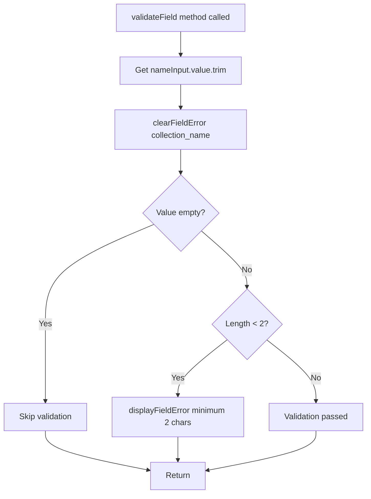

**Exact Code Location:**
```javascript
// File: create-collection-modal.js, Lines 450-480
validateField() {
    const name = this.nameInput.value.trim();              // Line 452

    // Line 454: Clear previous error
    this.clearFieldError('collection_name');               // Line 455

    if (name && name.length > 0 && name.length < 2) {      // Line 457
        this.displayFieldError('collection_name', 'Minimum 2 characters required'); // Line 458
    }
}
```

**Error Display Process:**
```javascript
// File: create-collection-modal.js, Lines 580-600
displayFieldError(fieldName, message) {
    const errorContainer = document.getElementById(`${fieldName}-error`); // Line 582
    if (errorContainer) {
        errorContainer.textContent = message;              // Line 584
        errorContainer.classList.remove('hidden');        // Line 585
    }

    // Line 588: Add error styling to input
    const input = document.getElementById(fieldName);
    if (input) {
        input.classList.add('border-red-500', 'focus:border-red-500', 'focus:ring-red-500'); // Line 591
    }
}
```

---

# 🔥 **SECTION C: AJAX SUBMISSION PROCESS**

## **C1: Form Submission Handler**

### **File: `create-collection-modal.js` (Lines 250-290)**

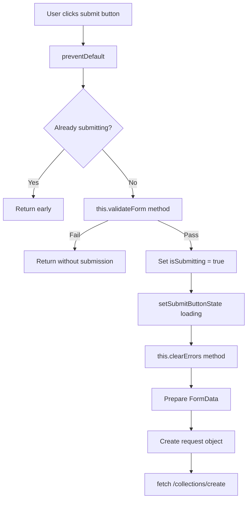

**Exact Code Location:**
```javascript
// File: create-collection-modal.js, Lines 250-290
async handleSubmit(event) {
    event.preventDefault();                                // Line 252

    if (this.isSubmitting) return;                        // Line 254

    try {
        // Line 257: Client-side pre-validation
        if (!this.validateForm()) {                       // Line 258
            return;
        }

        this.isSubmitting = true;                         // Line 262
        this.setSubmitButtonState('loading');             // Line 263
        this.clearErrors();                               // Line 264

        // Line 266: Data Preparation
        const formData = new FormData(this.form);         // Line 267
        const requestData = {
            collection_name: formData.get('collection_name').trim(), // Line 269
            _token: formData.get('_token')                // Line 270
        };

        // Line 273: AJAX Request with comprehensive error handling
        const response = await fetch('/collections/create', {
            method: 'POST',                               // Line 275
            headers: {
                'Content-Type': 'application/json',       // Line 277
                'Accept': 'application/json',             // Line 278
                'X-Requested-With': 'XMLHttpRequest'      // Line 279
            },
            body: JSON.stringify(requestData)             // Line 281
        });

        const result = await response.json();             // Line 284

        if (result.success) {
            this.handleSuccess(result);                   // Line 287
        } else {
            this.handleError(result);                     // Line 289
        }

    } catch (error) {
        this.handleNetworkError(error);                   // Line 292
    } finally {
        this.isSubmitting = false;                        // Line 294
    }
}
```

**Request Payload Structure:**
```json
{
    "collection_name": "User Entered Name",
    "_token": "Laravel CSRF Token"
}
```

---

## **C2: Client-Side Validation**

### **File: `create-collection-modal.js` (Lines 400-440)**

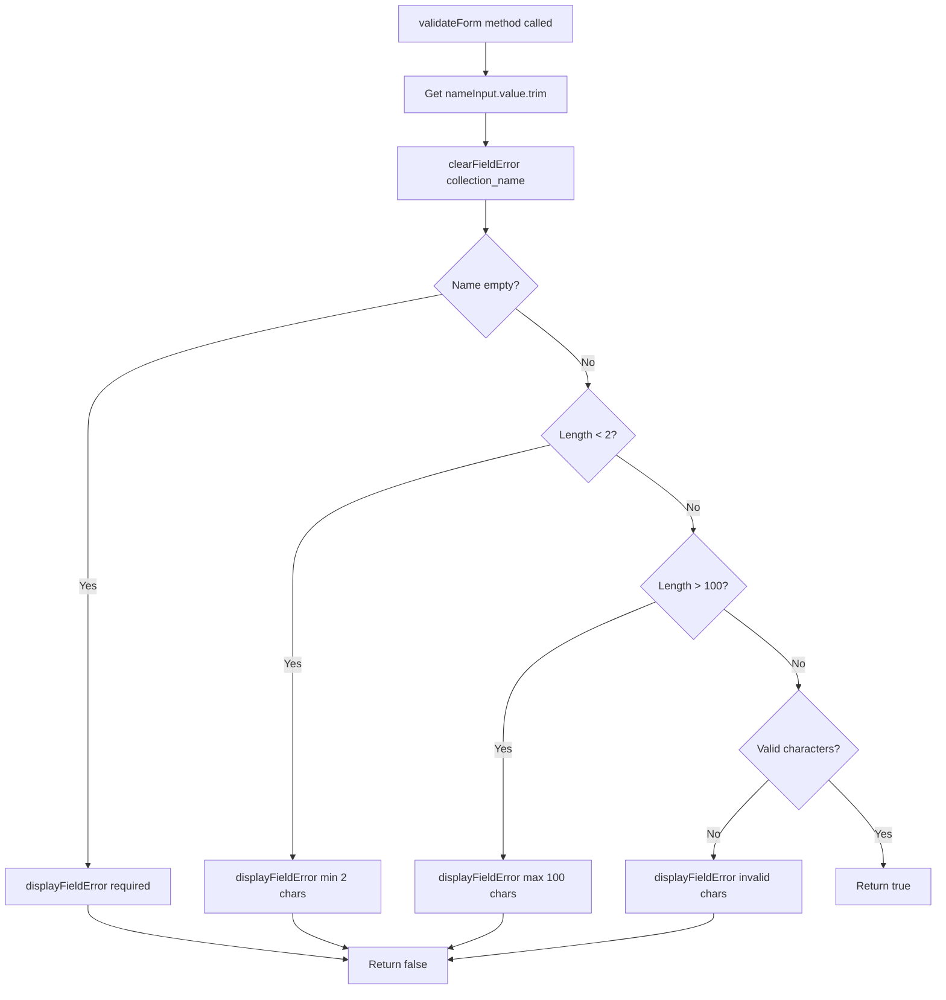

**Exact Code Location:**
```javascript
// File: create-collection-modal.js, Lines 400-440
validateForm() {
    const name = this.nameInput.value.trim();              // Line 402

    // Line 404: Clear previous errors
    this.clearFieldError('collection_name');               // Line 405

    // Line 407: Required validation
    if (!name) {
        this.displayFieldError('collection_name', 'Collection name is required'); // Line 409
        return false;                                      // Line 410
    }

    // Line 413: Length validation
    if (name.length < 2) {
        this.displayFieldError('collection_name', 'Collection name must be at least 2 characters'); // Line 415
        return false;                                      // Line 416
    }

    if (name.length > 100) {
        this.displayFieldError('collection_name', 'Collection name cannot exceed 100 characters'); // Line 420
        return false;                                      // Line 421
    }

    // Line 424: Character validation
    const validPattern = /^[a-zA-Z0-9\s\-_'"À-ÿ]+$/u;     // Line 425
    if (!validPattern.test(name)) {
        this.displayFieldError('collection_name', 'Collection name contains invalid characters'); // Line 427
        return false;                                      // Line 428
    }

    return true;                                           // Line 431
}
```

**Validation Rules Applied:**
1. **Required**: Name cannot be empty
2. **Min Length**: At least 2 characters  
3. **Max Length**: Maximum 100 characters
4. **Pattern**: Letters, numbers, spaces, hyphens, underscores, quotes, accented chars

---

# 🔥 **SECTION D: LARAVEL BACKEND FLOW**

## **D1: Request Reception & Routing**

### **File: `routes/web.php` & `app/Http/Controllers/CollectionsController.php`**

```mermaid
flowchart LR
    AJAXRequest[AJAX POST /collections/create] --> LaravelRouter[Laravel Router]
    LaravelRouter --> Middleware[Middleware Stack]
    Middleware --> AuthMiddleware[Authentication check]
    AuthMiddleware --> CSRFCheck[CSRF token validation]
    CSRFCheck --> Controller[CollectionsController@create]
```

**Route Definition:**
```php
// File: routes/web.php
Route::middleware('collection_can:create_collection')->group(function () {
    Route::post('/collections/create', [CollectionsController::class, 'create'])
        ->name('collections.create');
});
```

**Controller Method Called:**
```php
// File: app/Http/Controllers/CollectionsController.php
public function create(Request $request)
{
    // Method implementation
}
```

---

## **D2: Server-Side Validation**

### **File: `app/Http/Controllers/CollectionsController.php` (Enhanced Method)**

```mermaid
flowchart TD
    ControllerMethod[CollectionsController@create] --> ValidateRequest[Request validation]
    ValidateRequest --> CheckName{collection_name valid?}
    CheckName -->|No| ValidationError[Return validation errors]
    CheckName -->|Yes| CheckUser{User authenticated?}
    CheckUser -->|No| AuthError[Return unauthorized]
    CheckUser -->|Yes| CallService[CollectionService::createDefaultCollection]
    
    ValidationError --> ReturnJSON[Return JSON error response]
    AuthError --> ReturnJSON
```

**Exact Code Location:**
```php
// File: app/Http/Controllers/CollectionsController.php (Enhanced)
public function create(Request $request)
{
    try {
        // Server-side validation
        $validated = $request->validate([
            'collection_name' => 'required|string|min:2|max:100|regex:/^[a-zA-Z0-9\s\-_\'"À-ÿ]+$/u'
        ]);

        $user = Auth::user();
        if (!$user) {
            return response()->json([
                'success' => false,
                'error' => 'AUTHENTICATION_REQUIRED',
                'message' => 'You must be logged in to create collections.'
            ], 401);
        }

        // Create collection via service
        $collection = app(CollectionService::class)->createDefaultCollection(
            $user, 
            true, // isDefault
            $validated['collection_name']
        );

        if ($collection instanceof JsonResponse) {
            // Service returned error
            return $collection;
        }

        return response()->json([
            'success' => true,
            'message' => 'Collection created successfully!',
            'collection' => [
                'id' => $collection->id,
                'name' => $collection->collection_name
            ],
            'next_action' => [
                'url' => route('collections.open')
            ]
        ]);

    } catch (\Illuminate\Validation\ValidationException $e) {
        return response()->json([
            'success' => false,
            'error' => 'VALIDATION_FAILED',
            'message' => 'Validation failed.',
            'errors' => $e->errors()
        ], 422);

    } catch (\Exception $e) {
        Log::error('Collection creation failed', [
            'user_id' => Auth::id(),
            'error' => $e->getMessage()
        ]);

        return response()->json([
            'success' => false,
            'error' => 'CREATION_FAILED',
            'message' => 'An error occurred while creating the collection.'
        ], 500);
    }
}
```

---

## **D3: Collection Service Integration**

### **File: `app/Services/CollectionService.php` (Method: `createDefaultCollection`)**

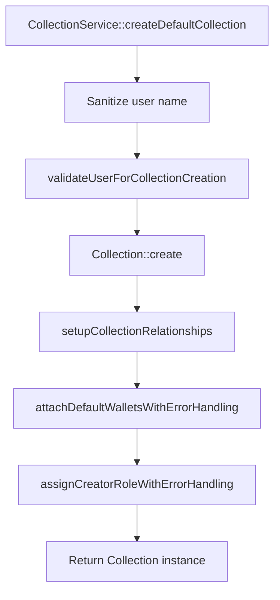

**Exact Code Location:**
```php
// File: app/Services/CollectionService.php, Lines 120-180
public function createDefaultCollection(User $user, ?bool $isDefault = true, ?string $collectionName = ''): Collection|JsonResponse
{
    // Line 122: Enhanced name sanitization
    $firstName = $this->sanitizeUserName($user->name);     // Line 123

    if (empty($collectionName)) {
        $collectionName = "{$firstName}'s Collection";     // Line 127
    }

    $logContext = [
        'creator_id' => $user->id,                         // Line 131
        'collection_name' => $collectionName,              // Line 132
        'operation' => 'create_default_collection'         // Line 133
    ];

    $this->logger->info('[CollectionService] Starting default collection creation', $logContext); // Line 135

    try {
        // Line 138: Enhanced validation
        $this->validateUserForCollectionCreation($user);   // Line 139

        // Line 141: Create collection with enhanced data
        $collection = Collection::create([
            'creator_id'      => $user->id,                // Line 143
            'owner_id'        => $user->id,                // Line 144
            'epp_id'          => config('app.epp_id'),     // Line 145
            'is_default'      => $isDefault,               // Line 146
            'collection_name' => $collectionName,          // Line 147
            'description'     => trans('collection.collection_description_placeholder', [], 'en') ?: 'Default collection automatically created for single EGI uploads.', // Line 148
            'type'            => config('egi.default_type', 'image'), // Line 150
            'position'        => $this->calculateCollectionPosition($user), // Line 151
            'EGI_number'      => 1,                        // Line 152
            'floor_price'     => (float) config('egi.default_floor_price', 0.0), // Line 153
            'is_published'    => true,                     // Line 154
            'status'          => 'local',                  // Line 155
            'created_via'     => 'collection_service'      // Line 156
        ]);

        // Lines 159-170: Enhanced setup
        $this->setupCollectionRelationships($collection, $user, $enhancedLogContext);
        $this->attachDefaultWalletsWithErrorHandling($collection, $user, $enhancedLogContext);
        $this->assignCreatorRoleWithErrorHandling($user, $enhancedLogContext);

        return $collection;                                // Line 175

    } catch (Throwable $e) {
        // Lines 177-185: Error handling with UEM
        return $this->errorManager->handle('COLLECTION_CREATION_FAILED', $errorContext, $e);
    }
}
```

**Database Changes:**
- New row in `collections` table
- User's `current_collection_id` updated
- Collection-user pivot record created
- Creator role assigned via Spatie permissions

---

# 🔥 **SECTION E: ERROR SCENARIOS**

## **E1: Client-Side Error Handling**

### **Network Error Flow**

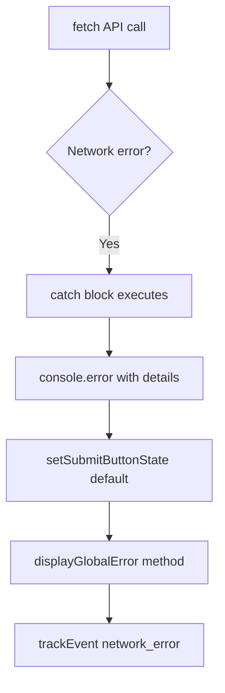

**Exact Code Location:**
```javascript
// File: create-collection-modal.js, Lines 320-340
handleNetworkError(error) {
    console.error('[CreateCollectionModal] Network error:', error); // Line 322

    this.setSubmitButtonState('default');                 // Line 324
    this.displayGlobalError('Network error. Please check your connection and try again.'); // Line 325

    // Line 327: Analytics tracking
    this.trackEvent('network_error', { error: error.message }); // Line 328
}
```

### **Server Validation Error Flow**

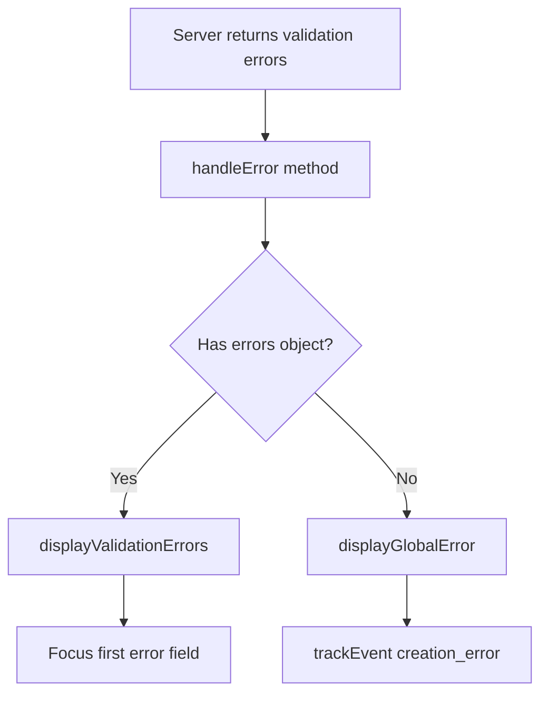

**Exact Code Location:**
```javascript
// File: create-collection-modal.js, Lines 300-320
handleError(result) {
    this.setSubmitButtonState('default');                 // Line 302

    // Line 304: Error Classification
    if (result.errors) {
        // Validation errors
        this.displayValidationErrors(result.errors);      // Line 307
    } else {
        // General server errors
        this.displayGlobalError(result.message || 'An unexpected error occurred'); // Line 310
    }

    // Line 313: Accessibility - announce error to screen readers
    const errorElement = document.getElementById('global-error-message');
    if (errorElement && !errorElement.classList.contains('hidden')) {
        errorElement.focus();                              // Line 316
    }

    // Line 319: Analytics tracking
    this.trackEvent('creation_error', {
        error_type: result.error,                          // Line 321
        error_message: result.message                      // Line 322
    });
}
```

---

## **E2: Server-Side Error Handling**

### **UEM Integration Flow**

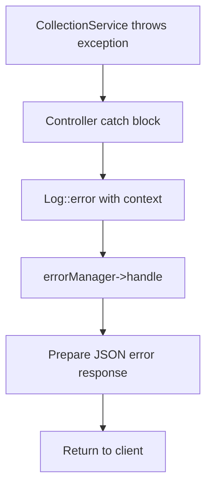

**Error Codes Used:**
- `COLLECTION_CREATION_FAILED`: Database or service errors
- `VALIDATION_FAILED`: Input validation errors  
- `AUTHENTICATION_REQUIRED`: User not logged in
- `CREATION_FAILED`: Generic creation errors

---

# 🔥 **SECTION F: CONTEXT-AWARE BEHAVIOR**

## **F1: Context Detection**

### **File: `create-collection-modal-context.js` (Lines 20-50)**

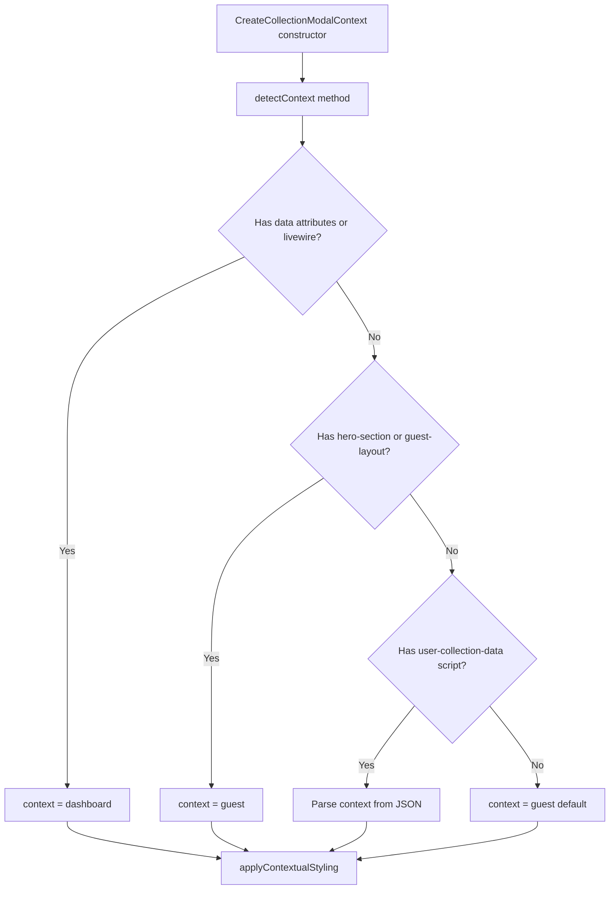

**Exact Code Location:**
```javascript
// File: create-collection-modal-context.js, Lines 20-50
detectContext() {
    // Line 22: Check for dashboard-specific elements
    if (document.querySelector('[x-data]') || document.querySelector('.livewire')) {
        return 'dashboard';                                // Line 24
    }

    // Line 27: Check for guest-specific elements
    if (document.getElementById('hero-section') || document.querySelector('.guest-layout')) {
        return 'guest';                                    // Line 29
    }

    // Line 32: Check user data script for context hint
    const userDataScript = document.getElementById('user-collection-data');
    if (userDataScript) {
        try {
            const userData = JSON.parse(userDataScript.textContent); // Line 36
            return userData.context || 'guest';           // Line 37
        } catch (e) {
            // Fallback detection
        }
    }

    // Line 43: Default fallback
    return 'guest';                                        // Line 44
}
```

---

## **F2: Context-Specific Behavior**

### **Dashboard vs Guest Differences**

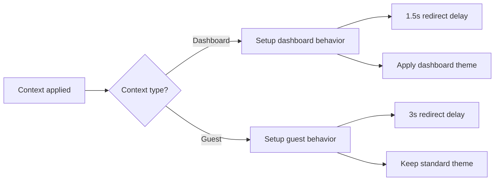

**Dashboard-Specific Modifications:**
```javascript
// File: create-collection-modal-context.js, Lines 90-120
setupDashboardBehavior() {
    // Override success handler for dashboard
    const originalHandleSuccess = window.CreateCollectionModal?.instance()?.handleSuccess;

    if (originalHandleSuccess) {
        window.CreateCollectionModal.instance().handleSuccess = (result) => {
            // Show success state briefly
            this.showQuickSuccess(result);                 // Line 98

            // Shorter redirect delay for dashboard
            setTimeout(() => {
                if (result.next_action?.url) {
                    window.location.href = result.next_action.url; // Line 103
                } else {
                    window.location.reload();              // Line 105
                }
            }, 1500); // Shorter delay for dashboard         // Line 107
        };
    }
}
```

---

# 🔥 **SECTION G: DEBUGGING & MONITORING**

## **G1: Frontend Debug Points**

### **Key Debug Breakpoints**

```mermaid
flowchart LR
    TriggerClick[Trigger clicked] --> DebugPoint1[Debug: bindTriggerButtons Line 125]
    DebugPoint1 --> ModalOpen[Modal opens] --> DebugPoint2[Debug: open method Line 154]
    DebugPoint2 --> UserInput[User types] --> DebugPoint3[Debug: handleInputChange Line 337]
    DebugPoint3 --> FormSubmit[Form submit] --> DebugPoint4[Debug: handleSubmit Line 252]
    DebugPoint4 --> AJAXCall[AJAX request] --> DebugPoint5[Debug: fetch call Line 273]
```

**Debug Instructions:**
```javascript
// File: create-collection-modal.js

// 🔍 Debug Point 1 (Line 125): Check trigger binding
console.log('Trigger clicked:', e.target, 'Modal instance:', this);

// 🔍 Debug Point 2 (Line 154): Check modal opening
console.log('Opening modal, isOpen:', this.isOpen, 'Elements:', {
    modal: this.modal,
    form: this.form,
    nameInput: this.nameInput
});

// 🔍 Debug Point 3 (Line 337): Check input handling
console.log('Input changed, value:', this.nameInput.value, 'Length:', this.nameInput.value.length);

// 🔍 Debug Point 4 (Line 252): Check form submission
console.log('Form submitting, isSubmitting:', this.isSubmitting, 'Form data:', new FormData(this.form));

// 🔍 Debug Point 5 (Line 273): Check AJAX request
console.log('Sending request:', requestData, 'URL:', '/collections/create');
```

---

## **G2: Backend Debug Points**

### **Laravel Debug Flow**

```mermaid
flowchart LR
    RequestReceived[Request received] --> DebugPoint1[Debug: Controller create method]
    DebugPoint1 --> Validation[Validation] --> DebugPoint2[Debug: Validation rules]
    DebugPoint2 --> ServiceCall[Service call] --> DebugPoint3[Debug: CollectionService]
    DebugPoint3 --> DatabaseOp[Database operation] --> DebugPoint4[Debug: Collection created]
    DebugPoint4 --> Response[JSON response] --> DebugPoint5[Debug: Response sent]
```

**Debug Instructions:**
```php
// File: app/Http/Controllers/CollectionsController.php

// 🔍 Debug Point 1: Controller method start
Log::info('Collection creation started', [
    'user_id' => Auth::id(),
    'request_data' => $request->all()
]);

// 🔍 Debug Point 2: Validation
Log::info('Validation completed', [
    'validated_data' => $validated
]);

// 🔍 Debug Point 3: Service call
Log::info('Calling CollectionService', [
    'user_id' => $user->id,
    'collection_name' => $validated['collection_name']
]);

// 🔍 Debug Point 4: Collection created
Log::info('Collection created successfully', [
    'collection_id' => $collection->id,
    'collection_name' => $collection->collection_name
]);

// 🔍 Debug Point 5: Response preparation
Log::info('Sending response', [
    'success' => true,
    'collection_id' => $collection->id
]);
```

---

## **G3: Common Debug Scenarios**

### **🚨 "Modal not opening"**
1. Check: Line 125 - trigger event binding worked?
2. Check: Line 65 - DOM elements cached correctly?
3. Check: Line 154 - open() method called?
4. Check: Browser console for JavaScript errors

### **🚨 "Form not submitting"**
1. Check: Line 252 - handleSubmit called?  
2. Check: Line 258 - validateForm() returning true?
3. Check: Line 273 - fetch() call executing?
4. Check: Network tab for actual HTTP request

### **🚨 "Server returning errors"**
1. Check: Controller validation rules match client rules
2. Check: User authentication status
3. Check: CSRF token presence in request
4. Check: CollectionService logs for creation errors

### **🚨 "Success but no redirect"**
1. Check: Line 287 - handleSuccess called?
2. Check: result.next_action.url value
3. Check: setTimeout execution (Lines 1500/3000ms)
4. Check: Context detection (dashboard vs guest)

---

# 🎯 **DEVELOPER QUICK REFERENCE**

## **File-by-File Ownership Map**

| Component | File | Key Methods/Lines |
|-----------|------|-------------------|
| **Core Modal** | `create-collection-modal.js` | `open()` (150-185), `handleSubmit()` (250-290) |
| **Context Logic** | `create-collection-modal-context.js` | `detectContext()` (20-50), `setupDashboardBehavior()` (90-120) |
| **Backend** | `CollectionsController.php` | `create()` (enhanced method) |
| **Service** | `CollectionService.php` | `createDefaultCollection()` (120-180) |
| **Template** | `create-collection-modal.blade.php` | Modal HTML structure |

## **Modal State Lifecycle**

| State | Properties | DOM Classes | User Actions |
|-------|------------|-------------|--------------|
| **Closed** | `isOpen: false` | `.hidden` | Can trigger open |
| **Opening** | `isOpen: true` | `.modal-open` | Animation playing |
| **Open** | `isOpen: true` | `.modal-open` | Can type, submit, close |
| **Submitting** | `isSubmitting: true` | `.btn-loading` | Button disabled |
| **Success** | `isOpen: true` | Success state visible | Countdown to redirect |
| **Error** | `isOpen: true` | Error messages shown | Can retry |

## **Request/Response Flow Summary**

```
Client JS → POST /collections/create → CollectionsController@create → 
CollectionService::createDefaultCollection → Database → JSON Response → 
Client Success/Error Handler → UI Update → Redirect
```

**This documentation provides developers with exact code locations, variable states, and step-by-step execution flow for debugging and extending the Create Collection Modal system.**