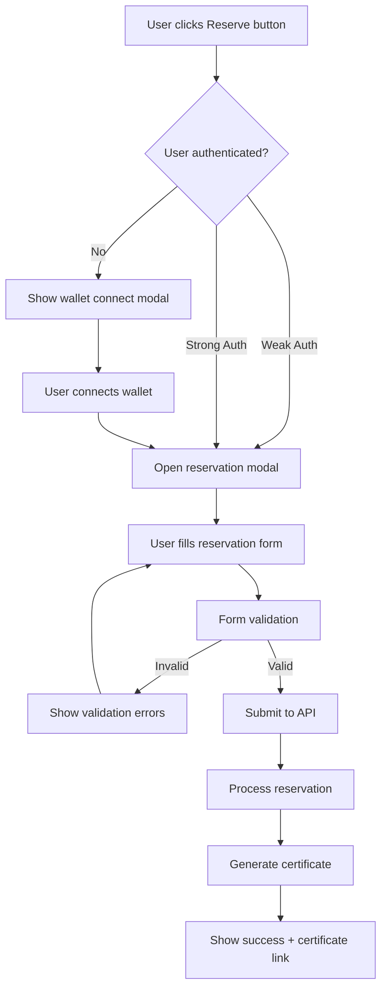

# FlorenceEGI Reservation System - Complete Technical Documentation

**Version:** 1.0.0  
**Date:** May 16, 2025  
**Author:** Padmin D. Curtis (for Fabio Cherici)  
**Framework:** Laravel 11 + TypeScript SPA  
**Architecture:** Ultra Ecosystem + Oracode 2.0 Compliant  

---

## Abstract

Il **Sistema di Prenotazioni FlorenceEGI** è un'implementazione completa e robusta per la gestione delle prenotazioni di opere d'arte digitali (EGI - Ecological, Goods, Invent) all'interno della piattaforma FlorenceEGI. Il sistema supporta un approccio **Web2-to-Web3 progressivo**, permettendo sia utenti con autenticazione "debole" (solo wallet connesso) che con autenticazione "forte" (account completo) di effettuare prenotazioni.

### Caratteristiche Principali:
- **🔐 Multi-Level Authentication**: Supporta sia weak auth (wallet) che strong auth (account completo)
- **💰 Dynamic Pricing**: Conversione automatica EUR/ALGO con tassi di cambio real-time
- **📜 Digital Certificates**: Generazione automatica di certificati di prenotazione con firma digitale
- **🏆 Priority System**: Sistema di priorità basato su tipo di utente e importo dell'offerta
- **🛡️ Security & Privacy**: Completamente GDPR-compliant con gestione errori UEM integrata
- **♿ Accessibility**: Interfaccia completamente accessibile con supporto ARIA e Schema.org
- **📱 Responsive SPA**: Interfaccia completamente reattiva integrata nel layout guest dinamico

### Flusso Operativo:
1. **Visualizzazione**: L'utente visualizza un EGI e clicca il pulsante "Reserve"
2. **Autenticazione**: Il sistema verifica lo stato di autenticazione dell'utente
3. **Form Submission**: L'utente compila il form con l'offerta in EUR e dati opzionali
4. **Processing**: Il sistema converte EUR/ALGO, crea la prenotazione e calcola le priorità
5. **Certificazione**: Viene generato automaticamente un certificato digitale verificabile
6. **Notification**: L'utente riceve conferma con link al certificato

---

## File Structure Overview

### Backend Components

#### 🗄️ **Database & Migrations**
```
database/migrations/
├── xxxx_xx_xx_xxxxxx_extend_reservations_table.php
└── xxxx_xx_xx_xxxxxx_create_egi_reservation_certificates_table.php
```

#### 🏗️ **Models**
```
app/Models/
├── Reservation.php (extended)
└── EgiReservationCertificate.php
```

#### 🎮 **Controllers**
```
app/Http/Controllers/
├── Api/ReservationController.php
├── Api/CurrencyController.php
└── EgiReservationCertificateController.php
```

#### 🔧 **Services**
```
app/Services/
├── ReservationService.php
├── CurrencyService.php
└── CertificateGeneratorService.php
```

#### 📋 **Form Requests**
```
app/Http/Requests/
├── StoreReservationRequest.php
└── UpdateReservationRequest.php
```

#### 🌐 **Routes**
```
routes/
├── api.php (reservation API routes)
└── web.php (certificate web routes)
```

### Frontend Components

#### 📜 **TypeScript Core**
```
resources/ts/
├── services/
│   └── reservationService.ts
├── features/reservations/
│   ├── reservationFeature.ts
│   └── reservationButtons.ts
└── main.ts (updated)
```

#### 🎨 **Views (Blade)**
```
resources/views/certificates/
├── show.blade.php
└── verify.blade.php
```

#### 🌍 **Translations**
```
resources/lang/en/
├── reservation.php
├── certificate.php
└── errors.php (updated)

resources/lang/it/
├── reservation.php
├── certificate.php
└── errors.php (updated)
```

### Configuration Files

#### ⚙️ **Core Configuration**
```
config/
├── error-manager.php (updated with reservation errors)
└── icons.php (updated)
```

#### 🗃️ **Database Structure**
```
reservations table (extended):
├── id (primary key)
├── egi_id (foreign key)
├── user_id (foreign key)
├── wallet_address (string)
├── offer_amount_eur (decimal)
├── offer_amount_algo (decimal)
├── reservation_type (enum: 'weak', 'strong')
├── contact_data (json, nullable)
├── is_current (boolean)
├── created_at
└── updated_at

egi_reservation_certificates table:
├── id (primary key)
├── certificate_uuid (unique)
├── reservation_id (foreign key)
├── egi_id (foreign key)
├── wallet_address (string)
├── reservation_type (enum)
├── offer_amount_eur (decimal)
├── offer_amount_algo (decimal)
├── signature_hash (string)
├── pdf_path (nullable)
├── is_superseded (boolean)
├── is_current_highest (boolean)
├── created_at
└── updated_at
```

---

## Technical Flow Documentation

### 1. Frontend Initialization Flow

```typescript
// main.ts initialization sequence
1. UEM Client Service initialized
2. App configuration loaded from API
3. DOM references confirmed
4. Reservation feature initialized
5. Reservation buttons initialized
6. Event listeners attached
```

#### Key Components:
- **reservationService.ts**: Core API communication and modal management
- **reservationFeature.ts**: General reservation functionality integration
- **reservationButtons.ts**: Specific button management and state updates

### 2. User Interaction Flow



### 3. Backend Processing Flow

#### API Endpoint: `POST /api/egis/{id}/reserve`

```php
// ReservationController@store flow
1. Authentication check (optional - supports both weak/strong auth)
2. Request validation (StoreReservationRequest)
3. EGI availability check
4. Existing reservation check
5. Currency conversion (EUR to ALGO)
6. Reservation creation via ReservationService
7. Priority calculation and updates
8. Certificate generation
9. Response with certificate data
```

#### Priority System Logic:

```php
// Priority calculation rules:
1. Strong auth reservations > Weak auth reservations
2. Within same auth type: Higher EUR amount > Lower EUR amount
3. Same amount: Earlier timestamp > Later timestamp
4. is_current flag updated for highest priority reservation
```

### 4. Certificate Generation Flow

```php
// CertificateGeneratorService flow
1. Generate unique UUID for certificate
2. Calculate signature hash (reservation data + timestamp)
3. Create EgiReservationCertificate record
4. Update priority flags across all reservations for the EGI
5. Queue PDF generation job (optional)
6. Return certificate data with URLs
```

### 5. Error Handling Flow

#### UEM Integration:
```php
// All errors routed through UEM system
1. Exception caught in controller/service
2. Error mapped to UEM error code
3. Context sanitized (GDPR-compliant)
4. Response generated based on error configuration
5. Notifications sent if configured (email/Slack)
6. Frontend receives structured error response
```

#### Frontend Error Handling:
```typescript
// TypeScript error handling pattern
try {
    await reservationOperation();
} catch (error) {
    UEM.handleClientError('RESERVATION_ERROR_CODE', context, error);
}
```

---

## API Documentation

### Core Endpoints

#### **POST** `/api/egis/{id}/reserve`
Create a new reservation for an EGI.

**Authentication:** Optional (supports weak/strong auth)

**Request Body:**
```json
{
    "offer_amount_eur": 150.00,
    "terms_accepted": true,
    "contact_data": {
        "name": "Optional Name",
        "email": "optional@email.com",
        "message": "Optional message"
    }
}
```

**Response (Success):**
```json
{
    "success": true,
    "message": "Reservation created successfully",
    "reservation": {
        "id": 123,
        "type": "strong",
        "offer_amount_eur": 150.00,
        "offer_amount_algo": 750.00000000,
        "status": "active",
        "is_current": true
    },
    "certificate": {
        "uuid": "550e8400-e29b-41d4-a716-446655440000",
        "url": "/certificates/550e8400-e29b-41d4-a716-446655440000",
        "verification_url": "/certificates/550e8400-e29b-41d4-a716-446655440000/verify",
        "pdf_url": "/certificates/550e8400-e29b-41d4-a716-446655440000/download"
    }
}
```

#### **GET** `/api/egis/{id}/reservation-status`
Get reservation status for an EGI.

**Authentication:** Optional

**Response:**
```json
{
    "success": true,
    "data": {
        "egi_id": 456,
        "is_reserved": true,
        "total_reservations": 3,
        "user_has_reservation": true,
        "highest_priority_reservation": {
            "type": "strong",
            "offer_amount_eur": 200.00,
            "belongs_to_current_user": false
        },
        "user_reservation": {
            "id": 123,
            "type": "strong",
            "offer_amount_eur": 150.00,
            "offer_amount_algo": 750.00000000,
            "is_highest_priority": false,
            "created_at": "2025-05-16T10:30:00Z",
            "certificate": {
                "uuid": "550e8400-e29b-41d4-a716-446655440000",
                "url": "/certificates/550e8400-e29b-41d4-a716-446655440000"
            }
        }
    }
}
```

#### **GET** `/api/algo-exchange-rate`
Get current ALGO/EUR exchange rate.

**Authentication:** None

**Response:**
```json
{
    "success": true,
    "message": "Exchange rate retrieved successfully",
    "rate": 0.20000000,
    "updated_at": "2025-05-16T10:00:00Z"
}
```

#### **DELETE** `/api/reservations/{id}`
Cancel a reservation.

**Authentication:** Required (reservation owner only)

**Response:**
```json
{
    "success": true,
    "message": "Reservation cancelled successfully"
}
```

### Certificate Endpoints

#### **GET** `/certificates/{uuid}`
Display certificate page.

#### **GET** `/certificates/{uuid}/verify`
Verify certificate authenticity.

#### **GET** `/certificates/{uuid}/download`
Download certificate PDF.

---

## Testing Guidelines

### Backend Testing

#### Unit Tests
```php
// Test file: tests/Unit/Services/ReservationServiceTest.php
class ReservationServiceTest extends TestCase
{
    /** @test */
    public function it_creates_reservation_with_valid_data() { }
    
    /** @test */
    public function it_calculates_priority_correctly() { }
    
    /** @test */
    public function it_handles_currency_conversion() { }
    
    /** @test */
    public function it_generates_certificate() { }
}
```

#### Feature Tests
```php
// Test file: tests/Feature/ReservationApiTest.php
class ReservationApiTest extends TestCase
{
    /** @test */
    public function authenticated_user_can_create_reservation() { }
    
    /** @test */
    public function weak_auth_user_can_create_reservation() { }
    
    /** @test */
    public function unauthenticated_user_cannot_create_reservation() { }
    
    /** @test */
    public function user_cannot_create_duplicate_reservation() { }
}
```

### Frontend Testing

#### TypeScript Unit Tests
```typescript
// Test file: resources/ts/__tests__/reservationService.test.ts
describe('ReservationService', () => {
    test('should initialize modal correctly', () => {});
    test('should handle API errors gracefully', () => {});
    test('should update button states', () => {});
});
```

#### E2E Testing Scenarios
1. **Complete Reservation Flow**: User clicks button → fills form → submits → views certificate
2. **Error Handling**: Network errors, validation errors, server errors
3. **Authentication States**: Guest, weak auth, strong auth user journeys
4. **Priority System**: Multiple reservations on same EGI
5. **Certificate Verification**: QR code scanning, verification page

---

## Debugging Guidelines

### Common Issues & Solutions

#### 1. **Reservation Modal Not Opening**
```typescript
// Debug checklist:
1. Check console for JavaScript errors
2. Verify UEM initialization: `UEM.initialize()`
3. Check button has data-egi-id attribute
4. Verify reservationButtons.initialize() was called
5. Check DOM elements exist (modal container)
```

#### 2. **API Calls Failing**
```php
// Debug steps:
1. Check routes are registered: `php artisan route:list | grep reservation`
2. Verify CSRF token is included in requests
3. Check authentication middleware
4. Review error logs: `tail -f storage/logs/laravel.log`
5. Test API endpoints directly with Postman/curl
```

#### 3. **Certificate Generation Issues**
```php
// Debug checklist:
1. Check certificate model relationships
2. Verify signature hash generation
3. Check PDF generation queue jobs
4. Review file permissions for PDF storage
5. Test certificate verification logic
```

#### 4. **Currency Conversion Problems**
```php
// Debug steps:
1. Check external API connectivity
2. Verify CurrencyService configuration
3. Test fallback rate mechanisms
4. Review rate caching logic
5. Check database rate storage
```

### Logging & Monitoring

#### ULM Integration
```php
// Service logging example
$this->logger->info('Reservation created', [
    'log_category' => 'RESERVATION_CREATED',
    'egi_id' => $egiId,
    'user_id' => $userId,
    'offer_amount_eur' => $offerAmount
]);
```

#### UEM Error Tracking
```php
// Error handling with context
ultra_error('RESERVATION_CREATE_FAILED', [
    'egi_id' => $egiId,
    'user_id' => $userId,
    'validation_errors' => $errors
], $exception);
```

### Performance Optimization

#### Database Queries
```php
// Optimize reservation status queries
Reservation::with(['egi', 'user', 'certificate'])
    ->where('egi_id', $egiId)
    ->orderByPriority()
    ->get();
```

#### Frontend Performance
```typescript
// Debounce button clicks
const debouncedReserveClick = debounce(handleReservationClick, 300);

// Cache reservation status
const reservationStatusCache = new Map();
```

#### Caching Strategy
```php
// Cache exchange rates
Cache::remember('algo_eur_rate', 300, function() {
    return $this->currencyService->getRate('ALGO', 'EUR');
});

// Cache reservation counts
Cache::tags(['reservations', 'egi_' . $egiId])
    ->remember("egi_reservation_count_{$egiId}", 60, function() {
        return Reservation::where('egi_id', $egiId)->count();
    });
```

---

## Security Considerations

### GDPR Compliance
- **Data Minimization**: Only collect necessary contact data
- **Consent**: Explicit terms acceptance required
- **Sanitization**: UEM automatically sanitizes sensitive data in logs
- **Right to Deletion**: Reservation cancellation removes personal data

### Wallet Security
- **No Private Keys**: Only wallet addresses stored
- **Signature Verification**: Certificate signatures prevent tampering
- **Access Control**: Users can only access their own reservations

### API Security
- **Rate Limiting**: Prevent spam reservations
- **Input Validation**: All inputs validated and sanitized
- **CSRF Protection**: All state-changing requests protected
- **Authentication**: Proper auth checks for sensitive operations

---

## Future Evolution Guidelines

### Extensibility Points

#### 1. **Payment Integration**
```php
// Add payment processor in ReservationService
interface PaymentProcessorInterface {
    public function processPayment(Reservation $reservation): PaymentResult;
}
```

#### 2. **Notification System**
```php
// Extend notification channels
class ReservationNotificationService {
    public function notifyReservationCreated(Reservation $reservation);
    public function notifyPriorityChanged(Reservation $reservation);
}
```

#### 3. **Advanced Auction Features**
```php
// Add auction-specific logic
class AuctionReservationService extends ReservationService {
    public function handleBidding(int $egiId, float $bidAmount): BidResult;
}
```

#### 4. **Web3 Integration**
```typescript
// Add blockchain verification
class Web3CertificateService {
    async mintCertificateNFT(certificate: Certificate): Promise<NFTResult>;
    async verifyCertificateOnChain(uuid: string): Promise<VerificationResult>;
}
```

### Migration Path to Full Web3

1. **Phase 1** (Current): Web2 with wallet connectivity
2. **Phase 2**: Smart contract integration for reservations
3. **Phase 3**: NFT certificate minting
4. **Phase 4**: Full decentralized auction system

### Performance Scaling

#### Database Optimization
```sql
-- Add indexes for common queries
CREATE INDEX idx_reservations_egi_priority ON reservations(egi_id, is_current, offer_amount_eur DESC);
CREATE INDEX idx_certificates_lookup ON egi_reservation_certificates(certificate_uuid, is_superseded);
```

#### Caching Strategy
```php
// Implement Redis caching for high-traffic scenarios
class CachedReservationService extends ReservationService {
    protected function getCachedReservationStatus(int $egiId) {
        return Cache::tags(['reservations'])->remember(
            "egi_status_{$egiId}",
            60,
            fn() => parent::getReservationStatus($egiId)
        );
    }
}
```

---

## Conclusion

Il Sistema di Prenotazioni FlorenceEGI rappresenta un'implementazione completa e robusta che bilancia la facilità d'uso con la sicurezza e la scalabilità. Seguendo i principi di Oracode 2.0, il sistema garantisce codice mantenibile, accessibile e pronto per l'evoluzione verso un ecosistema Web3 completo.

La documentazione fornita offre tutti gli strumenti necessari per sviluppatori futuri per comprendere, debuggare, testare e estendere il sistema mantenendo la coerenza architettonica e gli standard di qualità stabiliti.

**Per supporto tecnico o domande sull'implementazione, consultare la documentazione UEM, ULM e UTM del progetto FlorenceEGI.**