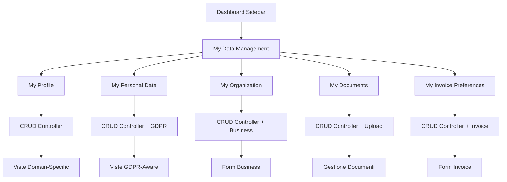

# Guida Implementazione CRUD Domini Utente

## Sistema Sidebar Intelligente + Separazione Domini + Compliance GDPR

### 📋 **Documento di Implementazione Completo**

**Autore:** Padmin D. Curtis (per Fabio Cherici)  
**Versione:** 2.0.0 - SISTEMA CORRETTO  
**Data:** 4 Giugno 2025  
**Obiettivo:** Implementare CRUD completi per 5 domini dati attraverso sidebar contextual

---

## 🎯 **Panoramica Esecutiva**

Questo documento descrive l'implementazione completa del sistema CRUD per i **5 domini dati utente** attraverso il sistema sidebar esistente, mantenendo:

- **Architettura esistente** (ContextMenus, MenuGroup, MenuItem, IconRepository)
- **Sistema permission granulare** (Spatie + domini specifici)
- **Compliance GDPR** per domini ultra-sensitive
- **Pattern "My Data"** (utente gestisce solo i propri dati)
- **Integrazione UEM** per error handling robusto
- **Compliance Oracode OS1** in ogni implementazione
- **MenuConditionEvaluator** per filtro automatico permessi

### **Domini da Implementare:**

1. **My Profile** - Dati pubblici/semi-pubblici (titolo, bio, social media)
2. **My Personal Data** - GDPR ultra-sensitive (indirizzo, codice_fiscale, data_nascita)
3. **My Organization** - Dati business (solo enterprise)
4. **My Documents** - Documenti + status verifica
5. **My Invoice Preferences** - Preferenze fatturazione

---

## 🏗️ **Architettura di Implementazione**

### **Pattern Implementativo**



### **Stack Tecnologico**

- **Backend:** Controller Laravel (RESTful)
- **Frontend:** Template Blade + Tailwind CSS + DaisyUI
- **Sidebar:** Sistema esistente (ContextMenus + MenuItem + MenuConditionEvaluator)
- **Permessi:** Spatie Laravel Permission
- **Error Handling:** UEM (Ultra Error Manager)
- **GDPR:** ConsentService + AuditLogService
- **Icone:** IconRepository (SVG colorati)

---

## 📂 **FASE 1: Estensione Sistema Sidebar (CORRETTA)**

### **1.1 Nuovo Contesto Menu: "dashboard" (ESTESO)**

**File: `app/Services/Menu/ContextMenus.php`**

```php
// MODIFICARE il case 'dashboard' esistente
case 'dashboard':
    // ... menu esistenti (collections, statistics, notifications, etc.) ...
    
    // ✅ NUOVO: My Data Management - TUTTI i menu creati sempre
    $userDataMenu = new MenuGroup(__('menu.my_data_management'), 'user-cog', [
        new MyProfileMenu(),           // permission: 'edit_own_profile_data'
        new MyPersonalDataMenu(),      // permission: 'edit_own_personal_data'
        new MyOrganizationMenu(),      // permission: 'edit_own_organization_data'
        new MyDocumentsMenu(),         // permission: 'manage_own_documents'
        new MyInvoicePreferencesMenu(), // permission: 'manage_own_invoice_preferences'
    ]);
    $menus[] = $userDataMenu;
    
    break;
```

**⚠️ NOTA CRUCIALE:** Non usiamo più controlli hardcoded sui user types. `MenuConditionEvaluator` filtrerà automaticamente `MyOrganizationMenu` mostrando il menu solo agli utenti con il permesso `'edit_own_organization_data'`.

### **1.2 Nuovi MenuItem per Domini**

**Creare in: `app/Services/Menu/Items/`**

**MyProfileMenu.php**

```php
<?php

namespace App\Services\Menu\Items;

use App\Services\Menu\MenuItem;

class MyProfileMenu extends MenuItem
{
    public function __construct()
    {
        parent::__construct(
            'menu.my_profile',              // Traduzione
            'user.profile.edit',            // Route
            'user-circle',                  // Icona
            'edit_own_profile_data'         // Permission (filtrato da MenuConditionEvaluator)
        );
    }
}
```

**MyPersonalDataMenu.php**

```php
<?php

namespace App\Services\Menu\Items;

use App\Services\Menu\MenuItem;

class MyPersonalDataMenu extends MenuItem
{
    public function __construct()
    {
        parent::__construct(
            'menu.my_personal_data',
            'user.personal-data.edit',
            'shield-check',                 // Icona GDPR
            'edit_own_personal_data'        // Permission
        );
    }
}
```

**MyOrganizationMenu.php**

```php
<?php

namespace App\Services\Menu\Items;

use App\Services\Menu\MenuItem;

class MyOrganizationMenu extends MenuItem
{
    public function __construct()
    {
        parent::__construct(
            'menu.my_organization',
            'user.organization.edit',
            'building-office-2',
            'edit_own_organization_data'    // Solo utenti con questo permesso vedranno il menu
        );
    }
}
```

**MyDocumentsMenu.php**

```php
<?php

namespace App\Services\Menu\Items;

use App\Services\Menu\MenuItem;

class MyDocumentsMenu extends MenuItem
{
    public function __construct()
    {
        parent::__construct(
            'menu.my_documents',
            'user.documents.index',
            'document-text',
            'manage_own_documents'
        );
    }
}
```

**MyInvoicePreferencesMenu.php**

```php
<?php

namespace App\Services\Menu\Items;

use App\Services\Menu\MenuItem;

class MyInvoicePreferencesMenu extends MenuItem
{
    public function __construct()
    {
        parent::__construct(
            'menu.my_invoice_preferences',
            'user.invoice-preferences.edit',
            'receipt-tax',
            'manage_own_invoice_preferences'
        );
    }
}
```

### **1.3 Nuove Icone per Domini**

**File: `config/icons.php`**

```php
// AGGIUNGERE queste icone al file esistente:

'user-cog' => [
    'name' => 'Gestione Utente',
    'type' => 'heroicon',
    'class' => 'w-5 h-5',
    'html' => '<svg fill="#60A5FA" viewBox="0 0 24 24" class="%class%">
        <path fill-rule="evenodd" d="M11.828 2.25c-.916 0-1.699.663-1.85 1.567l-.091.549a.798.798 0 01-.517.608 7.45 7.45 0 00-.478.198.798.798 0 01-.796-.064l-.453-.324a1.875 1.875 0 00-2.416.2l-.243.243a1.875 1.875 0 00-.2 2.416l.324.453a.798.798 0 01.064.796 7.448 7.448 0 00-.198.478.798.798 0 01-.608.517l-.55.092a1.875 1.875 0 00-1.566 1.849v.344c0 .916.663 1.699 1.567 1.85l.549.091c.281.047.508.25.608.517.06.162.127.321.198.478a.798.798 0 01-.064.796l-.324.453a1.875 1.875 0 00.2 2.416l.243.243c.648.648 1.67.733 2.416.2l.453-.324a.798.798 0 01.796-.064c.157.071.316.137.478.198.267.1.47.327.517.608l.092.55c.15.903.932 1.566 1.849 1.566h.344c.916 0 1.699-.663 1.85-1.567l.091-.549a.798.798 0 01.517-.608 7.52 7.52 0 00.478-.198.798.798 0 01.796.064l.453.324a1.875 1.875 0 002.416-.2l.243-.243c.648-.648.733-1.67.2-2.416l-.324-.453a.798.798 0 01-.064-.796c.071-.157.137-.316.198-.478.1-.267.327-.47.608-.517l.55-.091a1.875 1.875 0 001.566-1.85v-.344c0-.916-.663-1.699-1.567-1.85l-.549-.091a.798.798 0 01-.608-.517 7.507 7.507 0 00-.198-.478.798.798 0 01.064-.796l.324-.453a1.875 1.875 0 00-.2-2.416l-.243-.243a1.875 1.875 0 00-2.416-.2l-.453.324a.798.798 0 01-.796.064 7.462 7.462 0 00-.478-.198.798.798 0 01-.517-.608l-.091-.55a1.875 1.875 0 00-1.85-1.566h-.344zM12 15.75a3.75 3.75 0 100-7.5 3.75 3.75 0 000 7.5z" clip-rule="evenodd" />
    </svg>'
],

'shield-check' => [
    'name' => 'Protezione GDPR',
    'type' => 'heroicon',
    'class' => 'w-5 h-5',
    'html' => '<svg fill="#10B981" viewBox="0 0 24 24" class="%class%">
        <path fill-rule="evenodd" d="M12.516 2.17a.75.75 0 00-1.032 0 11.209 11.209 0 01-7.877 3.08.75.75 0 00-.722.515A12.74 12.74 0 002.25 9.75c0 5.814 3.051 10.77 7.608 13.543a.75.75 0 00.784 0C15.199 20.52 18.25 15.564 18.25 9.75a12.74 12.74 0 00-.635-3.985.75.75 0 00-.722-.515 11.209 11.209 0 01-7.877-3.08zM15.75 9.75a.75.75 0 00-1.5 0v2.25H12a.75.75 0 000 1.5h2.25v2.25a.75.75 0 001.5 0v-2.25H18a.75.75 0 000-1.5h-2.25V9.75z" clip-rule="evenodd" />
    </svg>'
],

'building-office-2' => [
    'name' => 'Organizzazione',
    'type' => 'heroicon',
    'class' => 'w-5 h-5',
    'html' => '<svg fill="#F59E0B" viewBox="0 0 24 24" class="%class%">
        <path fill-rule="evenodd" d="M3 2.25a.75.75 0 01.75-.75h16.5a.75.75 0 01.75.75v15.75a.75.75 0 01-.75.75h-16.5a.75.75 0 01-.75-.75V2.25zm1.5 1.5v13.5h15V3.75H4.5zM6 6a.75.75 0 01.75-.75h2.5a.75.75 0 010 1.5h-2.5A.75.75 0 016 6zm0 3a.75.75 0 01.75-.75h2.5a.75.75 0 010 1.5h-2.5A.75.75 0 016 9zm0 3a.75.75 0 01.75-.75h2.5a.75.75 0 010 1.5h-2.5A.75.75 0 016 12zm6-6a.75.75 0 01.75-.75h2.5a.75.75 0 010 1.5h-2.5A.75.75 0 0112 6zm0 3a.75.75 0 01.75-.75h2.5a.75.75 0 010 1.5h-2.5A.75.75 0 0112 9zm0 3a.75.75 0 01.75-.75h2.5a.75.75 0 010 1.5h-2.5A.75.75 0 0112 12z" clip-rule="evenodd" />
    </svg>'
],

'document-text' => [
    'name' => 'Documenti',
    'type' => 'heroicon',
    'class' => 'w-5 h-5',
    'html' => '<svg fill="#8B5CF6" viewBox="0 0 24 24" class="%class%">
        <path fill-rule="evenodd" d="M5.625 1.5c-1.036 0-1.875.84-1.875 1.875v17.25c0 1.035.84 1.875 1.875 1.875h12.75c1.035 0 1.875-.84 1.875-1.875V12.75A3.75 3.75 0 0016.5 9h-1.875a1.875 1.875 0 01-1.875-1.875V5.25A3.75 3.75 0 009 1.5H5.625zM7.5 15a.75.75 0 01.75-.75h7.5a.75.75 0 010 1.5h-7.5A.75.75 0 017.5 15zm.75-3.75a.75.75 0 000 1.5h3a.75.75 0 000-1.5h-3z" clip-rule="evenodd" />
        <path d="M12.971 1.816A5.23 5.23 0 0114.25 5.25v1.875c0 .207.168.375.375.375H16.5a5.23 5.23 0 013.434 1.279 9.768 9.768 0 00-6.963-6.963z" />
    </svg>'
],

'receipt-tax' => [
    'name' => 'Fatturazione',
    'type' => 'heroicon',
    'class' => 'w-5 h-5',
    'html' => '<svg fill="#EF4444" viewBox="0 0 24 24" class="%class%">
        <path fill-rule="evenodd" d="M12 2.25c-5.385 0-9.75 4.365-9.75 9.75s4.365 9.75 9.75 9.75 9.75-4.365 9.75-9.75S17.385 2.25 12 2.25zM9 7.5A.75.75 0 0110.5 9v1.5h3V9a.75.75 0 011.5 0v1.5h1.5a.75.75 0 010 1.5H15v3h1.5a.75.75 0 010 1.5H15V18a.75.75 0 01-1.5 0v-1.5h-3V18A.75.75 0 019 16.5v-1.5H7.5a.75.75 0 010-1.5H9v-3H7.5a.75.75 0 010-1.5H9V7.5z" clip-rule="evenodd" />
    </svg>'
],
```

**⚠️ IMPORTANTE:** Dopo aver aggiunto le icone, eseguire:

```bash
php artisan db:seed --class=IconSeeder
php artisan cache:clear
```

---

## 🎛️ **FASE 2: Controller CRUD per Domini**

### **2.1 Pattern Base Controller**

**Struttura comune per tutti i controller:**

```php
<?php

namespace App\Http\Controllers\User;

use App\Http\Controllers\Controller;
use Illuminate\Http\Request;
use Ultra\ErrorManager\Interfaces\ErrorManagerInterface;
use Ultra\UltraLogManager\UltraLogManager;
use App\Services\Gdpr\AuditLogService;

/**
 * @Oracode Controller Base: User Domain Management
 * 🎯 Purpose: Shared functionality for user data domain controllers
 * 🛡️ Privacy: GDPR-aware base with audit logging
 * 🧱 Core Logic: Common patterns for "My Data" operations
 */
abstract class BaseUserDomainController extends Controller
{
    public function __construct(
        protected ErrorManagerInterface $errorManager,
        protected UltraLogManager $logger,
        protected AuditLogService $auditService
    ) {}
    
    /**
     * Log user action for GDPR audit trail
     */
    protected function logUserAction(
        string $action, 
        array $context = [], 
        string $category = 'user_data_management'
    ): void {
        $this->auditService->logUserAction(
            auth()->user(),
            $action,
            array_merge($context, [
                'ip_address' => request()->ip(),
                'user_agent' => request()->userAgent(),
                'timestamp' => now(),
            ]),
            $category
        );
    }
    
    /**
     * Handle errors with UEM integration
     */
    protected function handleError(
        string $errorCode, 
        array $context = [], 
        ?\Exception $exception = null
    ) {
        return $this->errorManager->handle($errorCode, array_merge($context, [
            'user_id' => auth()->id(),
            'controller' => get_class($this),
        ]), $exception);
    }
}
```

### **2.2 UserProfileController (Esempio Completo)**

**File: `app/Http/Controllers/User/UserProfileController.php`**

```php
<?php

namespace App\Http\Controllers\User;

use App\Models\UserProfile;
use App\Http\Requests\User\UpdateProfileRequest;
use Illuminate\Http\Request;
use Illuminate\Http\RedirectResponse;
use Illuminate\View\View;

/**
 * @Oracode Controller: User Profile Management (Public/Semi-Public Data)
 * 🎯 Purpose: CRUD operations for user public profile data
 * 🛡️ Privacy: Non-sensitive data, minimal GDPR implications
 * 🧱 Core Logic: "My Data" pattern - user manages only own profile
 */
class UserProfileController extends BaseUserDomainController
{
    /**
     * Display user profile for editing
     */
    public function edit(): View
    {
        try {
            $user = auth()->user();
            $this->authorize('edit_own_profile_data');
            
            // Get or create profile
            $profile = $user->profile ?? UserProfile::create(['user_id' => $user->id]);
            
            $this->logger->info('[User Profile] Profile edit page accessed', [
                'user_id' => $user->id,
                'profile_exists' => !is_null($user->profile)
            ]);
            
            return view('user.profile.edit', compact('user', 'profile'));
            
        } catch (\Exception $e) {
            return $this->handleError('USER_PROFILE_ACCESS_FAILED', [
                'action' => 'edit_view'
            ], $e);
        }
    }

    /**
     * Update user profile
     */
    public function update(UpdateProfileRequest $request): RedirectResponse
    {
        try {
            $user = auth()->user();
            $this->authorize('edit_own_profile_data');
            
            $profile = $user->profile ?? UserProfile::create(['user_id' => $user->id]);
            $originalData = $profile->toArray();
            
            // Update profile data
            $profile->update($request->validated());
            
            // Log changes for audit trail
            $this->logUserAction('profile_data_updated', [
                'changed_fields' => array_keys($request->validated()),
                'data_category' => 'public_profile',
                'previous_data_hash' => hash('sha256', json_encode($originalData)),
                'new_data_hash' => hash('sha256', json_encode($profile->fresh()->toArray())),
            ], 'profile_management');
            
            $this->logger->info('[User Profile] Profile updated successfully', [
                'user_id' => $user->id,
                'changed_fields' => array_keys($request->validated())
            ]);
            
            return redirect()->route('user.profile.edit')
                ->with('success', __('Profilo aggiornato con successo'));
                
        } catch (\Exception $e) {
            return $this->handleError('USER_PROFILE_UPDATE_FAILED', [
                'action' => 'update',
                'input_data_fields' => array_keys($request->validated()),
            ], $e);
        }
    }
}
```

### **2.3 UserPersonalDataController (GDPR-Aware)**

**File: `app/Http/Controllers/User/UserPersonalDataController.php`**

```php
<?php

namespace App\Http\Controllers\User;

use App\Models\UserPersonalData;
use App\Http\Requests\User\UpdatePersonalDataRequest;
use App\Services\Gdpr\ConsentService;
use Illuminate\Http\RedirectResponse;
use Illuminate\View\View;

/**
 * @Oracode Controller: Personal Data Management (GDPR Ultra-Sensitive)
 * 🎯 Purpose: CRUD operations for GDPR-sensitive personal data
 * 🛡️ Privacy: Ultra-sensitive data with audit trail and consent verification
 * 🧱 Core Logic: GDPR-compliant updates with explicit consent tracking
 */
class UserPersonalDataController extends BaseUserDomainController
{
    public function __construct(
        protected ErrorManagerInterface $errorManager,
        protected UltraLogManager $logger,
        protected AuditLogService $auditService,
        protected ConsentService $consentService
    ) {
        parent::__construct($errorManager, $logger, $auditService);
    }

    public function edit(): View
    {
        try {
            $user = auth()->user();
            $this->authorize('edit_own_personal_data');
            
            // Verify GDPR consent for personal data processing
            if (!$this->consentService->hasConsent($user, 'personal_data_processing')) {
                return redirect()->route('user.consents.manage')
                    ->with('warning', __('Si prega di fornire il consenso per il trattamento dei dati personali prima di procedere'));
            }
            
            $personalData = $user->personalData ?? UserPersonalData::create(['user_id' => $user->id]);
            
            // Log access for GDPR audit
            $this->logUserAction('personal_data_accessed', [
                'data_category' => 'ultra_sensitive',
                'access_purpose' => 'user_self_modification',
                'gdpr_legal_basis' => 'user_consent',
            ], 'gdpr_personal_data');
            
            return view('user.personal-data.edit', compact('user', 'personalData'));
            
        } catch (\Exception $e) {
            return $this->handleError('USER_PERSONAL_DATA_ACCESS_FAILED', [
                'action' => 'edit_view',
                'gdpr_context' => 'personal_data_access'
            ], $e);
        }
    }

    public function update(UpdatePersonalDataRequest $request): RedirectResponse
    {
        try {
            $user = auth()->user();
            $this->authorize('edit_own_personal_data');
            
            // Double-check GDPR consent
            if (!$this->consentService->hasConsent($user, 'personal_data_processing')) {
                throw new \Exception('Consent for personal data processing is required');
            }
            
            $personalData = $user->personalData ?? UserPersonalData::create(['user_id' => $user->id]);
            $originalData = $personalData->toArray();
            
            // Update with GDPR-aware timestamp
            $updateData = $request->validated();
            $updateData['last_updated_at'] = now();
            $updateData['updated_by_user'] = true;
            
            $personalData->update($updateData);
            
            // Enhanced audit trail for GDPR compliance
            $this->logUserAction('personal_data_updated_gdpr_compliant', [
                'data_category' => 'ultra_sensitive',
                'changed_fields' => array_keys($request->validated()),
                'gdpr_legal_basis' => 'user_consent',
                'consent_verified_at' => now(),
                'data_retention_category' => 'essential_profile_data',
                'previous_data_hash' => hash('sha256', json_encode($originalData)),
                'new_data_hash' => hash('sha256', json_encode($personalData->fresh()->toArray())),
            ], 'gdpr_personal_data');
            
            $this->logger->info('[User Personal Data] GDPR-compliant personal data updated', [
                'user_id' => $user->id,
                'changed_fields' => array_keys($request->validated()),
                'consent_status' => 'verified'
            ]);
            
            return redirect()->route('user.personal-data.edit')
                ->with('success', __('Dati personali aggiornati con successo'));
                
        } catch (\Exception $e) {
            return $this->handleError('USER_PERSONAL_DATA_UPDATE_FAILED', [
                'action' => 'update',
                'gdpr_context' => 'personal_data_modification',
                'consent_required' => true
            ], $e);
        }
    }
}
```

### **2.4 Altri Controller (Pattern Simile)**

Gli altri controller seguono lo stesso pattern:

- **UserOrganizationController** - Solo per utenti con permesso `'edit_own_organization_data'`
- **UserDocumentsController** - Gestione upload documenti con verifica
- **UserInvoicePreferencesController** - Preferenze fatturazione

---

## 🎨 **FASE 3: Viste e UX per Domini**

### **3.1 Layout Base per Domini**

**File: `resources/views/user/layouts/domain-base.blade.php`**

```blade
@extends('layouts.app')

@section('content')
<div class="min-h-screen bg-gray-50">
    <div class="max-w-7xl mx-auto py-6 sm:px-6 lg:px-8">
        
        {{-- Domain Header --}}
        <div class="bg-white shadow rounded-lg mb-6">
            <div class="px-4 py-5 sm:p-6">
                <div class="flex items-center justify-between">
                    <div>
                        <h1 class="text-2xl font-bold text-gray-900">
                            @yield('domain-title')
                        </h1>
                        <p class="mt-1 text-sm text-gray-600">
                            @yield('domain-description')
                        </p>
                    </div>
                    <div class="flex items-center space-x-3">
                        @yield('domain-actions')
                    </div>
                </div>
            </div>
        </div>
        
        {{-- GDPR Notice (se richiesto) --}}
        @yield('gdpr-notice')
        
        {{-- Domain Content --}}
        <div class="bg-white shadow rounded-lg">
            <div class="px-4 py-5 sm:p-6">
                @yield('domain-content')
            </div>
        </div>
        
    </div>
</div>
@endsection

@push('scripts')
@yield('domain-scripts')
@endpush
```

### **3.2 Vista Profile Edit (Esempio)**

**File: `resources/views/user/profile/edit.blade.php`**

```blade
@extends('user.layouts.domain-base')

@section('domain-title', __('Il Mio Profilo'))
@section('domain-description', __('Gestisci le informazioni del tuo profilo pubblico'))

@section('domain-actions')
    <a href="{{ route('dashboard') }}" class="btn btn-ghost btn-sm">
        {{ __('Torna alla Dashboard') }}
    </a>
@endsection

@section('domain-content')
<form method="POST" action="{{ route('user.profile.update') }}" class="space-y-8">
    @csrf
    @method('PUT')
    
    {{-- Informazioni Base --}}
    <div class="border-b border-gray-200 pb-8">
        <h3 class="text-lg font-medium text-gray-900 mb-4">{{ __('Informazioni Professionali') }}</h3>
        <div class="grid grid-cols-1 gap-6 sm:grid-cols-2">
            <div>
                <label for="title" class="block text-sm font-medium text-gray-700 mb-2">
                    {{ __('Titolo Professionale') }}
                </label>
                <input type="text" 
                       name="title" 
                       id="title"
                       value="{{ old('title', $profile->title) }}"
                       maxlength="50"
                       class="input input-bordered w-full @error('title') input-error @enderror"
                       placeholder="{{ __('es. Senior Developer') }}">
                @error('title')
                    <div class="text-error text-sm mt-1">{{ $message }}</div>
                @enderror
            </div>
            
            <div>
                <label for="job_role" class="block text-sm font-medium text-gray-700 mb-2">
                    {{ __('Ruolo Lavorativo') }}
                </label>
                <input type="text" 
                       name="job_role" 
                       id="job_role"
                       value="{{ old('job_role', $profile->job_role) }}"
                       maxlength="40"
                       class="input input-bordered w-full @error('job_role') input-error @enderror"
                       placeholder="{{ __('es. Full Stack Developer') }}">
                @error('job_role')
                    <div class="text-error text-sm mt-1">{{ $message }}</div>
                @enderror
            </div>
        </div>
        
        <div class="mt-6">
            <label for="bio_title" class="block text-sm font-medium text-gray-700 mb-2">
                {{ __('Titolo Bio') }}
            </label>
            <input type="text" 
                   name="bio_title" 
                   id="bio_title"
                   value="{{ old('bio_title', $profile->bio_title) }}"
                   maxlength="50"
                   class="input input-bordered w-full @error('bio_title') input-error @enderror"
                   placeholder="{{ __('Una frase che ti rappresenta') }}">
            @error('bio_title')
                <div class="text-error text-sm mt-1">{{ $message }}</div>
            @enderror
        </div>
    </div>
    
    {{-- Storia Bio --}}
    <div class="border-b border-gray-200 pb-8">
        <h3 class="text-lg font-medium text-gray-900 mb-4">{{ __('La Tua Storia') }}</h3>
        <div>
            <label for="bio_story" class="block text-sm font-medium text-gray-700 mb-2">
                {{ __('Racconta la tua storia') }}
                <span class="text-sm text-gray-500">(max 1000 caratteri)</span>
            </label>
            <textarea name="bio_story" 
                      id="bio_story" 
                      rows="5"
                      maxlength="1000"
                      class="textarea textarea-bordered w-full @error('bio_story') textarea-error @enderror"
                      placeholder="{{ __('Condividi la tua esperienza, passioni, cosa ti motiva...') }}">{{ old('bio_story', $profile->bio_story) }}</textarea>
            @error('bio_story')
                <div class="text-error text-sm mt-1">{{ $message }}</div>
            @enderror
            <div class="text-sm text-gray-500 mt-1" id="char-counter">
                <span id="current-length">{{ strlen($profile->bio_story ?? '') }}</span>/1000 caratteri
            </div>
        </div>
    </div>
    
    {{-- Social Media --}}
    <div class="border-b border-gray-200 pb-8">
        <h3 class="text-lg font-medium text-gray-900 mb-4">{{ __('Social Media & Contatti') }}</h3>
        <div class="grid grid-cols-1 gap-6 sm:grid-cols-2">
            @php
                $socialFields = [
                    'site_url' => ['label' => 'Sito Web', 'placeholder' => 'https://tuosito.com'],
                    'linkedin' => ['label' => 'LinkedIn', 'placeholder' => 'https://linkedin.com/in/tuoprofilo'],
                    'instagram' => ['label' => 'Instagram', 'placeholder' => 'https://instagram.com/tuoprofilo'],
                    'facebook' => ['label' => 'Facebook', 'placeholder' => 'https://facebook.com/tuoprofilo'],
                    'social_x' => ['label' => 'X (Twitter)', 'placeholder' => 'https://x.com/tuoprofilo'],
                    'tiktok' => ['label' => 'TikTok', 'placeholder' => 'https://tiktok.com/@tuoprofilo'],
                ];
            @endphp
            
            @foreach($socialFields as $field => $config)
            <div>
                <label for="{{ $field }}" class="block text-sm font-medium text-gray-700 mb-2">
                    {{ __($config['label']) }}
                </label>
                <input type="url" 
                       name="{{ $field }}" 
                       id="{{ $field }}"
                       value="{{ old($field, $profile->$field) }}"
                       class="input input-bordered w-full @error($field) input-error @enderror"
                       placeholder="{{ $config['placeholder'] }}">
                @error($field)
                    <div class="text-error text-sm mt-1">{{ $message }}</div>
                @enderror
            </div>
            @endforeach
        </div>
    </div>
    
    {{-- Azioni --}}
    <div class="flex justify-end space-x-3 pt-6">
        <button type="button" 
                onclick="window.history.back()"
                class="btn btn-ghost">
            {{ __('Annulla') }}
        </button>
        <button type="submit"
                class="btn btn-primary">
            <svg class="w-5 h-5 mr-2" fill="none" stroke="currentColor" viewBox="0 0 24 24">
                <path stroke-linecap="round" stroke-linejoin="round" stroke-width="2" d="M5 13l4 4L19 7"></path>
            </svg>
            {{ __('Salva Profilo') }}
        </button>
    </div>
</form>
@endsection

@section('domain-scripts')
<script>
document.addEventListener('DOMContentLoaded', function() {
    const bioStory = document.getElementById('bio_story');
    const currentLength = document.getElementById('current-length');
    
    if (bioStory && currentLength) {
        bioStory.addEventListener('input', function() {
            currentLength.textContent = this.value.length;
        });
    }
});
</script>
@endsection
```

---

## 🔐 **FASE 4: Permessi e Sicurezza**

### **4.1 Nuovi Permessi per Domini**

**File: `database/seeders/RolesAndPermissionsSeeder.php`**

```php
<?php

namespace Database\Seeders;

use Illuminate\Database\Seeder;
use Spatie\Permission\Models\Role;
use Spatie\Permission\Models\Permission;

class RolesAndPermissionsSeeder extends Seeder
{
    public function run()
    {
        // Permessi esistenti + NUOVI per domini dati utente
        $permissions = [
            // ... permessi esistenti ...
            
            // ✅ NUOVI: Permessi domini dati utente
            'edit_own_profile_data',
            'edit_own_personal_data',
            'edit_own_organization_data',
            'manage_own_documents',
            'manage_own_invoice_preferences',
            
            // ✅ NUOVI: Permessi documenti specifici
            'upload_identity_documents',
            'verify_document_status',
            'download_own_documents',
            
            // ✅ NUOVI: Permessi fatturazione
            'configure_invoice_preferences',
            'view_own_invoices',
            'download_own_invoices',
        ];

        // Crea tutti i permessi
        foreach ($permissions as $permission) {
            Permission::firstOrCreate(['name' => $permission]);
        }

        // Assegnazione permessi ai ruoli esistenti
        $rolePermissions = [
            'creator' => [
                // ... permessi esistenti ...
                'edit_own_profile_data',
                'edit_own_personal_data',
                'edit_own_organization_data',  // ✅ Creator può gestire org data
                'manage_own_documents',
                'manage_own_invoice_preferences',
                'upload_identity_documents',
                'verify_document_status',
                'download_own_documents',
                'configure_invoice_preferences',
                'view_own_invoices',
                'download_own_invoices',
            ],
            
            'patron' => [
                // ... permessi esistenti ...
                'edit_own_profile_data',
                'edit_own_personal_data',
                // ❌ Patron NON ha organization data
                'manage_own_documents',
                'manage_own_invoice_preferences',
                'upload_identity_documents',
                'verify_document_status',
                'download_own_documents',
                'configure_invoice_preferences',
                'view_own_invoices',
                'download_own_invoices',
            ],
            
            'collector' => [
                // ... permessi esistenti ...
                'edit_own_profile_data',
                'edit_own_personal_data',
                // ❌ Collector NON ha organization data
                'manage_own_documents',
                'manage_own_invoice_preferences',
                'upload_identity_documents',
                'verify_document_status',
                'download_own_documents',
                'configure_invoice_preferences',
                'view_own_invoices',
                'download_own_invoices',
            ],
            
            'enterprise' => [
                // ... permessi esistenti ...
                'edit_own_profile_data',
                'edit_own_personal_data',
                'edit_own_organization_data',  // ✅ Enterprise può gestire org data
                'manage_own_documents',
                'manage_own_invoice_preferences',
                'upload_identity_documents',
                'verify_document_status',
                'download_own_documents',
                'configure_invoice_preferences',
                'view_own_invoices',
                'download_own_invoices',
            ],
            
            'trader_pro' => [
                // ... permessi esistenti ...
                'edit_own_profile_data',
                'edit_own_personal_data',
                // ❌ Trader Pro NON ha organization data
                'manage_own_documents',
                'manage_own_invoice_preferences',
                'upload_identity_documents',
                'verify_document_status',
                'download_own_documents',
                'configure_invoice_preferences',
                'view_own_invoices',
                'download_own_invoices',
            ],
            
            'epp_entity' => [
                // ... permessi esistenti ...
                'edit_own_profile_data',
                'edit_own_personal_data',
                'edit_own_organization_data',  // ✅ EPP Entity può gestire org data
                'manage_own_documents',
                'manage_own_invoice_preferences',
                'upload_identity_documents',
                'verify_document_status',
                'download_own_documents',
                'configure_invoice_preferences',
                'view_own_invoices',
                'download_own_invoices',
            ],
        ];

        // Assegna permessi ai ruoli
        foreach ($rolePermissions as $roleName => $permissions) {
            $role = Role::findByName($roleName);
            $role->syncPermissions($permissions);
        }
    }
}
```

### **4.2 Request Validation Classes**

**File: `app/Http/Requests/User/UpdateProfileRequest.php`**

```php
<?php

namespace App\Http\Requests\User;

use Illuminate\Foundation\Http\FormRequest;

/**
 * @Oracode Request: User Profile Update Validation
 * 🎯 Purpose: Validate public profile data updates
 * 🛡️ Privacy: Non-sensitive data validation with security checks
 */
class UpdateProfileRequest extends FormRequest
{
    public function authorize(): bool
    {
        // ✅ Permission-based authorization (NON user type check)
        return $this->user()->can('edit_own_profile_data');
    }

    public function rules(): array
    {
        return [
            'title' => ['nullable', 'string', 'max:50'],
            'job_role' => ['nullable', 'string', 'max:40'],
            'bio_title' => ['nullable', 'string', 'max:50'],
            'bio_story' => ['nullable', 'string', 'max:1000'],
            'site_url' => ['nullable', 'url', 'max:2048'],
            'facebook' => ['nullable', 'url', 'max:2048'],
            'social_x' => ['nullable', 'url', 'max:2048'],
            'instagram' => ['nullable', 'url', 'max:2048'],
            'linkedin' => ['nullable', 'url', 'max:2048'],
            'tiktok' => ['nullable', 'url', 'max:2048'],
            'youtube' => ['nullable', 'url', 'max:2048'],
            'github' => ['nullable', 'url', 'max:2048'],
        ];
    }

    public function messages(): array
    {
        return [
            'bio_story.max' => __('La storia biografica non può superare i 1000 caratteri'),
            'title.max' => __('Il titolo professionale non può superare i 50 caratteri'),
            'job_role.max' => __('Il ruolo lavorativo non può superare i 40 caratteri'),
            'bio_title.max' => __('Il titolo bio non può superare i 50 caratteri'),
            '*.url' => __('Deve essere un URL valido'),
            '*.max' => __('Il campo non può superare :max caratteri'),
        ];
    }

    /**
     * Prepare data for validation - security sanitization
     */
    protected function prepareForValidation(): void
    {
        // Sanitize URLs
        $urlFields = ['site_url', 'facebook', 'social_x', 'instagram', 'linkedin', 'tiktok', 'youtube', 'github'];
        
        foreach ($urlFields as $field) {
            if ($this->has($field) && $this->$field) {
                $this->merge([
                    $field => filter_var($this->$field, FILTER_SANITIZE_URL)
                ]);
            }
        }
        
        // Sanitize text fields
        $textFields = ['title', 'job_role', 'bio_title', 'bio_story'];
        
        foreach ($textFields as $field) {
            if ($this->has($field) && $this->$field) {
                $this->merge([
                    $field => strip_tags($this->$field)
                ]);
            }
        }
    }
}
```

---

## 📊 **FASE 5: Routes e Navigation**

### **5.1 Routes per Domini**

**File: `routes/web.php`**

```php
<?php

use App\Http\Controllers\User\UserProfileController;
use App\Http\Controllers\User\UserPersonalDataController;
use App\Http\Controllers\User\UserOrganizationController;
use App\Http\Controllers\User\UserDocumentsController;
use App\Http\Controllers\User\UserInvoicePreferencesController;

// User Data Management Routes - Pattern "My Data"
Route::middleware(['auth', 'verified'])->prefix('my')->name('user.')->group(function () {
    
    // ✅ Profile Management (Dati Pubblici/Semi-Pubblici)
    Route::get('/profile', [UserProfileController::class, 'edit'])->name('profile.edit');
    Route::put('/profile', [UserProfileController::class, 'update'])->name('profile.update');
    
    // ✅ Personal Data (GDPR-sensitive)
    Route::get('/personal-data', [UserPersonalDataController::class, 'edit'])->name('personal-data.edit');
    Route::put('/personal-data', [UserPersonalDataController::class, 'update'])->name('personal-data.update');
    
    // ✅ Organization Data (auto-filtrato da middleware permission)
    Route::middleware('can:edit_own_organization_data')->group(function () {
        Route::get('/organization', [UserOrganizationController::class, 'edit'])->name('organization.edit');
        Route::put('/organization', [UserOrganizationController::class, 'update'])->name('organization.update');
    });
    
    // ✅ Documents Management
    Route::get('/documents', [UserDocumentsController::class, 'index'])->name('documents.index');
    Route::get('/documents/upload', [UserDocumentsController::class, 'create'])->name('documents.create');
    Route::post('/documents', [UserDocumentsController::class, 'store'])->name('documents.store');
    Route::get('/documents/{document}', [UserDocumentsController::class, 'show'])->name('documents.show');
    Route::get('/documents/{document}/download', [UserDocumentsController::class, 'download'])->name('documents.download');
    Route::delete('/documents/{document}', [UserDocumentsController::class, 'destroy'])->name('documents.destroy');
    
    // ✅ Invoice Preferences
    Route::get('/invoice-preferences', [UserInvoicePreferencesController::class, 'edit'])->name('invoice-preferences.edit');
    Route::put('/invoice-preferences', [UserInvoicePreferencesController::class, 'update'])->name('invoice-preferences.update');
});
```

### **5.2 Traduzioni Menu**

**File: `resources/lang/it/menu.php`**

```php
<?php

return [
    // ... traduzioni esistenti ...
    
    // ✅ NUOVE: Traduzioni domini dati utente
    'my_data_management' => 'Gestione Dati Personali',
    'my_profile' => 'Il Mio Profilo',
    'my_personal_data' => 'Dati Personali',
    'my_organization' => 'La Mia Organizzazione',
    'my_documents' => 'I Miei Documenti',
    'my_invoice_preferences' => 'Preferenze Fatturazione',
];
```

---

## 🧪 **FASE 6: Testing Strategy**

### **6.1 Feature Tests per Domini**

**File: `tests/Feature/User/UserProfileControllerTest.php`**

```php
<?php

namespace Tests\Feature\User;

use Tests\TestCase;
use App\Models\User;
use App\Models\UserProfile;
use Illuminate\Foundation\Testing\RefreshDatabase;
use Spatie\Permission\Models\Role;

class UserProfileControllerTest extends TestCase
{
    use RefreshDatabase;

    protected function setUp(): void
    {
        parent::setUp();
        
        // Crea ruoli per i test
        Role::create(['name' => 'creator']);
        Role::create(['name' => 'collector']);
    }

    /** @test */
    public function user_con_permesso_puo_visualizzare_pagina_edit_profilo()
    {
        $user = User::factory()->create(['usertype' => 'creator']);
        $user->assignRole('creator');
        
        $response = $this->actingAs($user)
            ->get(route('user.profile.edit'));
            
        $response->assertStatus(200);
        $response->assertViewIs('user.profile.edit');
        $response->assertViewHas('profile');
    }

    /** @test */
    public function user_puo_aggiornare_dati_profilo()
    {
        $user = User::factory()->create(['usertype' => 'creator']);
        $user->assignRole('creator');
        
        $profileData = [
            'title' => 'Senior Developer',
            'job_role' => 'Full Stack Developer',
            'bio_story' => 'Appassionato di creare esperienze digitali',
            'linkedin' => 'https://linkedin.com/in/johndoe'
        ];
        
        $response = $this->actingAs($user)
            ->put(route('user.profile.update'), $profileData);
            
        $response->assertRedirect(route('user.profile.edit'));
        $response->assertSessionHas('success');
        
        $this->assertDatabaseHas('user_profiles', [
            'user_id' => $user->id,
            'title' => 'Senior Developer',
            'job_role' => 'Full Stack Developer'
        ]);
    }

    /** @test */
    public function user_senza_permesso_non_puo_accedere_a_edit_profilo()
    {
        $user = User::factory()->create(['usertype' => 'collector']);
        // NON assegniamo il permesso 'edit_own_profile_data'
        $role = Role::findByName('collector');
        $role->revokePermissionTo('edit_own_profile_data'); // Assicuriamoci che non ce l'abbia
        $user->assignRole('collector');
        
        $response = $this->actingAs($user)
            ->get(route('user.profile.edit'));
            
        $response->assertStatus(403);
    }

    /** @test */
    public function menu_condition_evaluator_filtra_correttamente_menu_profilo()
    {
        $userWithPermission = User::factory()->create(['usertype' => 'creator']);
        $userWithPermission->assignRole('creator');
        
        $userWithoutPermission = User::factory()->create(['usertype' => 'collector']);
        $role = Role::findByName('collector');
        $role->revokePermissionTo('edit_own_profile_data');
        $userWithoutPermission->assignRole('collector');
        
        // Test che l'utente CON permesso veda il menu
        $this->actingAs($userWithPermission);
        $evaluator = new \App\Services\Menu\MenuConditionEvaluator();
        $menuItem = new \App\Services\Menu\Items\MyProfileMenu();
        
        $this->assertTrue($evaluator->shouldDisplay($menuItem));
        
        // Test che l'utente SENZA permesso NON veda il menu
        $this->actingAs($userWithoutPermission);
        $this->assertFalse($evaluator->shouldDisplay($menuItem));
    }

    /** @test */
    public function validazione_lunghezza_campi_funziona_correttamente()
    {
        $user = User::factory()->create(['usertype' => 'creator']);
        $user->assignRole('creator');
        
        $profileData = [
            'title' => str_repeat('A', 51), // Troppo lungo (max 50)
            'bio_story' => str_repeat('B', 1001), // Troppo lungo (max 1000)
        ];
        
        $response = $this->actingAs($user)
            ->put(route('user.profile.update'), $profileData);
            
        $response->assertSessionHasErrors(['title', 'bio_story']);
    }

    /** @test */
    public function url_social_media_devono_essere_validi()
    {
        $user = User::factory()->create(['usertype' => 'creator']);
        $user->assignRole('creator');
        
        $profileData = [
            'linkedin' => 'not-a-valid-url',
            'site_url' => 'also-not-valid',
        ];
        
        $response = $this->actingAs($user)
            ->put(route('user.profile.update'), $profileData);
            
        $response->assertSessionHasErrors(['linkedin', 'site_url']);
    }
}
```

### **6.2 Test MenuConditionEvaluator per Domini**

**File: `tests/Unit/Menu/MenuConditionEvaluatorTest.php`**

```php
<?php

namespace Tests\Unit\Menu;

use Tests\TestCase;
use App\Services\Menu\MenuConditionEvaluator;
use App\Services\Menu\Items\MyOrganizationMenu;
use App\Models\User;
use Spatie\Permission\Models\Role;
use Illuminate\Foundation\Testing\RefreshDatabase;

class MenuConditionEvaluatorTest extends TestCase
{
    use RefreshDatabase;

    protected function setUp(): void
    {
        parent::setUp();
        
        Role::create(['name' => 'enterprise']);
        Role::create(['name' => 'collector']);
    }

    /** @test */
    public function enterprise_user_vede_menu_organization()
    {
        $user = User::factory()->create(['usertype' => 'enterprise']);
        $user->assignRole('enterprise');
        
        $this->actingAs($user);
        
        $evaluator = new MenuConditionEvaluator();
        $menuItem = new MyOrganizationMenu();
        
        $this->assertTrue($evaluator->shouldDisplay($menuItem));
    }

    /** @test */
    public function collector_non_vede_menu_organization()
    {
        $user = User::factory()->create(['usertype' => 'collector']);
        $role = Role::findByName('collector');
        
        // Assicuriamoci che collector NON abbia il permesso organization
        $role->revokePermissionTo('edit_own_organization_data');
        $user->assignRole('collector');
        
        $this->actingAs($user);
        
        $evaluator = new MenuConditionEvaluator();
        $menuItem = new MyOrganizationMenu();
        
        $this->assertFalse($evaluator->shouldDisplay($menuItem));
    }

    /** @test */
    public function menu_senza_permesso_viene_sempre_mostrato()
    {
        $user = User::factory()->create(['usertype' => 'collector']);
        $user->assignRole('collector');
        
        $this->actingAs($user);
        
        $evaluator = new MenuConditionEvaluator();
        
        // Crea un menu item senza permesso richiesto
        $menuItem = new \App\Services\Menu\MenuItem(
            'menu.test',
            'test.route',
            'test-icon',
            null // Nessun permesso
        );
        
        $this->assertTrue($evaluator->shouldDisplay($menuItem));
    }
}
```

---

## ✅ **FASE 7: Checklist di Implementazione**

### **Backend Implementation**

- [ ] ✅ **ContextMenus corretto** - TUTTI i menu sempre creati, nessun controllo usertype hardcoded
- [ ] Creare 5 MenuItem classes per domini con permessi appropriati
- [ ] Aggiungere icone SVG colorate per domini in `config/icons.php`
- [ ] Implementare 5 controller CRUD con pattern "My Data" e BaseUserDomainController
- [ ] Creare Request validation classes per ogni dominio con security sanitization
- [ ] Aggiungere nuovi permessi granulari al seeder con assegnazione ai ruoli
- [ ] Implementare routes RESTful per domini con middleware appropriati
- [ ] Aggiungere error codes UEM per domini specifici

### **Frontend Implementation**

- [ ] Creare layout base per domini (`domain-base.blade.php`) con GDPR notice support
- [ ] Implementare 5 viste edit/index per domini con UX ottimizzata
- [ ] Styling Tailwind CSS + DaisyUI consistency
- [ ] Form validation frontend con contatori caratteri e sanitizzazione
- [ ] GDPR notices per dati ultra-sensitive
- [ ] Success/error messaging con UEM integration

### **GDPR & Security**

- [ ] ConsentService integration per dati sensitive con double-check
- [ ] AuditLogService per tracking modifiche con hash data per privacy
- [ ] IP + User Agent logging per audit completo
- [ ] Double consent verification per personal data
- [ ] Data retention policies per dominio
- [ ] Privacy-safe error messages via UEM

### **Testing & Quality**

- [ ] Feature tests per ogni controller con permission testing
- [ ] Unit tests per Request validation e MenuConditionEvaluator
- [ ] Permission testing (authorized/unauthorized) per ogni dominio
- [ ] GDPR compliance testing con consent flow
- [ ] UI/UX testing manuale con diversi user types
- [ ] Performance testing (sidebar rendering) con permission caching

---

## 🎯 **Deliverables Finali**

Al completamento di questa implementazione avrai:

### ✅ **Sistema CRUD Completo**

- 5 domini dati completamente gestibili con permission-based access
- Interface unificata attraverso sidebar intelligente (MenuConditionEvaluator)
- Pattern "My Data" - zero admin override, massima compliance GDPR
- GDPR compliance granulare per domini sensitive con audit trail completo

### ✅ **UX Eccellente**

- Sidebar contextual che si adatta automaticamente ai permessi utente
- Form domain-specific ottimizzati con validazione real-time
- Feedback visivo per ogni azione con UEM integration
- Coerenza totale con design system esistente

### ✅ **Architettura Robusta OS1**

- Controller RESTful con error handling UEM completo
- Permission system granulare e scalabile basato su capabilities
- Audit trail completo per compliance GDPR
- Testing coverage completa con permission scenarios

### ✅ **Scalabilità Futura**

- Pattern replicabile per nuovi domini dati
- Sistema icone estensibile con colori intrinseci
- Permission system modulare per nuovi user types
- Architecture Oracode OS1 compliant al 100%

---

## 📞 **Note per Implementazione**

### **Punti Chiave da Ricordare:**

1. **MenuConditionEvaluator è il Re** - Mai più controlli hardcoded usertype in ContextMenus
2. **Permessi Granulari** - Ogni azione ha il suo permesso specifico
3. **GDPR First** - Consent verification obbligatoria per personal data
4. **UEM Integration** - Error handling robusto e configurabile per ogni dominio
5. **Testing Permission-Based** - Test che verificano sia accesso che negazione

### **Pattern da Seguire:**

```php
// ✅ SEMPRE così in ContextMenus
new MyOrganizationMenu(), // MenuConditionEvaluator filtrerà automaticamente

// ❌ MAI più così  
...(auth()->user()->usertype === 'enterprise' ? [new MyOrganizationMenu()] : []),
```

### **Debugging Sidebar:**

Se un menu non appare:

1. Verifica che il permesso sia assegnato al ruolo in RolesAndPermissionsSeeder
2. Controlla che MenuConditionEvaluator.php stia filtrando correttamente
3. Usa `php artisan permission:cache-reset` se necessario

**Questa guida è pronta per l'implementazione immediata.** 🔥🚀