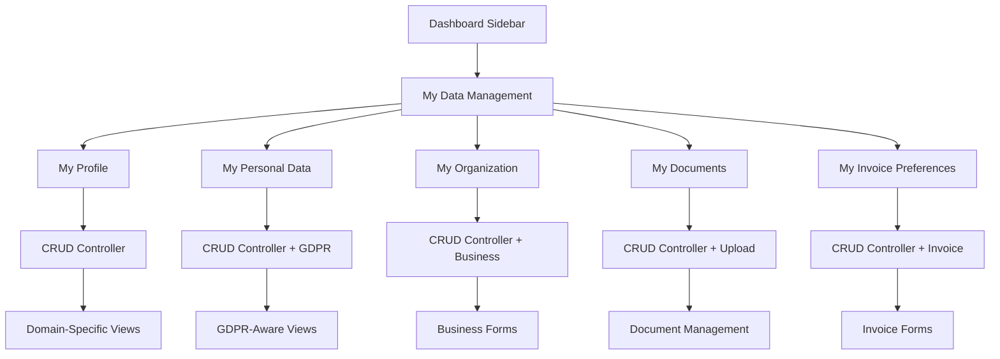

# Guida Implementazione CRUD Domini Utente
## Sistema Sidebar Intelligente + Domain Separation + GDPR Compliance

### 📋 **Documento di Implementazione Completo**
**Autore:** Padmin D. Curtis (per Fabio Cherici)  
**Versione:** 1.0.0 - POST REGISTRATION REWRITE  
**Data:** 4 Giugno 2025  
**Obiettivo:** Implementare CRUD completi per 5 domini dati attraverso sidebar contextual

---

## 🎯 **Executive Summary**

Questo documento descrive l'implementazione completa del sistema CRUD per i **5 domini dati utente** attraverso il sistema sidebar esistente, mantenendo:

- **Architettura esistente** (ContextMenus, MenuGroup, MenuItem, IconRepository)
- **Permission system** granulare (Spatie + domini specifici)
- **GDPR compliance** per domini ultra-sensitive
- **Pattern "My Data"** (utente gestisce solo i propri dati)
- **UEM integration** per error handling robusto
- **Oracode OS1 compliance** in ogni implementazione

### **Domini da Implementare:**
1. **My Profile** - Dati pubblici/semi-pubblici (title, bio, social media)
2. **My Personal Data** - GDPR ultra-sensitive (indirizzo, fiscal_code, birth_date)
3. **My Organization** - Dati business (solo enterprise)
4. **My Documents** - Documenti + verification status
5. **My Invoice Preferences** - Preferenze fatturazione

---

## 🏗️ **Architettura di Implementazione**

### **Pattern Implementativo**


### **Technology Stack**
- **Backend:** Laravel Controllers (RESTful)
- **Frontend:** Blade Templates + Tailwind CSS + DaisyUI
- **Sidebar:** Sistema esistente (ContextMenus + MenuItem)
- **Permissions:** Spatie Laravel Permission
- **Error Handling:** UEM (Ultra Error Manager)
- **GDPR:** ConsentService + AuditLogService
- **Icons:** IconRepository (SVG colorati)

---

## 📂 **FASE 1: Estensione Sistema Sidebar**

### **1.1 Nuovo Contesto Menu: "user-data-management"**

**File: `app/Services/Menu/ContextMenus.php`**
```php
// AGGIUNGERE questo case al metodo getMenusForContext()
case 'user-data-management':
    $userDataMenu = new MenuGroup(__('menu.my_data_management'), 'user-cog', [
        new MyProfileMenu(),           // edit_own_profile_data
        new MyPersonalDataMenu(),      // edit_own_personal_data  
        new MyOrganizationMenu(),      // edit_own_organization_data (solo se enterprise)
        new MyDocumentsMenu(),         // manage_own_documents
        new MyInvoicePreferencesMenu(), // manage_own_invoice_preferences
    ]);
    $menus[] = $userDataMenu;
    break;
```

### **1.2 Nuovi MenuItem per Domini**

**Creare in: `app/Services/Menu/Items/`**

**MyProfileMenu.php**
```php
namespace App\Services\Menu\Items;
use App\Services\Menu\MenuItem;

class MyProfileMenu extends MenuItem
{
    public function __construct()
    {
        parent::__construct(
            'menu.my_profile',              // Traduzione
            'user.profile.edit',            // Route
            'user-circle',                  // Icona
            'edit_own_profile_data'         // Permission
        );
    }
}
```

**MyPersonalDataMenu.php**
```php
namespace App\Services\Menu\Items;
use App\Services\Menu\MenuItem;

class MyPersonalDataMenu extends MenuItem
{
    public function __construct()
    {
        parent::__construct(
            'menu.my_personal_data',
            'user.personal-data.edit',
            'shield-check',                 // Icona GDPR
            'edit_own_personal_data'
        );
    }
}
```

**MyOrganizationMenu.php**
```php
namespace App\Services\Menu\Items;
use App\Services\Menu\MenuItem;

class MyOrganizationMenu extends MenuItem
{
    public function __construct()
    {
        parent::__construct(
            'menu.my_organization',
            'user.organization.edit',
            'building-office-2',
            'edit_own_organization_data'
        );
    }
}
```

**MyDocumentsMenu.php**
```php
namespace App\Services\Menu\Items;
use App\Services\Menu\MenuItem;

class MyDocumentsMenu extends MenuItem
{
    public function __construct()
    {
        parent::__construct(
            'menu.my_documents',
            'user.documents.index',
            'document-text',
            'manage_own_documents'
        );
    }
}
```

**MyInvoicePreferencesMenu.php**
```php
namespace App\Services\Menu\Items;
use App\Services\Menu\MenuItem;

class MyInvoicePreferencesMenu extends MenuItem
{
    public function __construct()
    {
        parent::__construct(
            'menu.my_invoice_preferences',
            'user.invoice-preferences.edit',
            'receipt-tax',
            'manage_own_invoice_preferences'
        );
    }
}
```

### **1.3 Aggiornamento Dashboard Sidebar**

**File: `app/Services/Menu/ContextMenus.php`**
```php
// Nel case 'dashboard', AGGIUNGERE:
case 'dashboard':
    // ... menu esistenti ...
    
    // NUOVO: My Data Management (sempre visibile per tutti)
    $userDataMenu = new MenuGroup(__('menu.my_data_management'), 'user-cog', [
        new MyProfileMenu(),
        new MyPersonalDataMenu(),
        // Solo se enterprise
        ...(auth()->user()->usertype === 'enterprise' ? [new MyOrganizationMenu()] : []),
        new MyDocumentsMenu(),
        new MyInvoicePreferencesMenu(),
    ]);
    $menus[] = $userDataMenu;
    
    break;
```

### **1.4 Nuove Icone per Domini**

**File: `config/icons.php`**
```php
// AGGIUNGERE queste icone:
'user-cog' => [
    'name' => 'User Settings',
    'type' => 'heroicon',
    'class' => 'w-5 h-5',
    'html' => '<svg fill="#60A5FA" viewBox="0 0 24 24" class="%class%">
        <path d="M17.982 18.725A7.488 7.488 0 0012 15.75a7.488 7.488 0 00-5.982 2.975m11.963 0a9 9 0 10-11.963 0m11.963 0A8.966 8.966 0 0112 21a8.966 8.966 0 01-5.982-2.275M15 9.75a3 3 0 11-6 0 3 3 0 016 0z"/>
    </svg>'
],

'shield-check' => [
    'name' => 'GDPR Shield',
    'type' => 'heroicon',
    'class' => 'w-5 h-5',
    'html' => '<svg fill="#10B981" viewBox="0 0 24 24" class="%class%">
        <path d="M9 12.75L11.25 15 15 9.75m-3-7.036A11.959 11.959 0 013.598 6 11.99 11.99 0 003 9.749c0 5.592 3.824 10.29 9 11.623 5.176-1.332 9-6.03 9-11.622 0-1.31-.21-2.571-.598-3.751h-.152c-3.196 0-6.1-1.248-8.25-3.285z"/>
    </svg>'
],

// ... altre icone per organization, documents, invoice
```

---

## 🎛️ **FASE 2: Controller CRUD per Domini**

### **2.1 Pattern Base Controller**

**Struttura comune per tutti i controller:**
```php
namespace App\Http\Controllers\User;

use App\Http\Controllers\Controller;
use Illuminate\Http\Request;
use Ultra\ErrorManager\Interfaces\ErrorManagerInterface;
use Ultra\UltraLogManager\UltraLogManager;
use App\Services\Gdpr\AuditLogService;

abstract class BaseUserDomainController extends Controller
{
    public function __construct(
        protected ErrorManagerInterface $errorManager,
        protected UltraLogManager $logger,
        protected AuditLogService $auditService
    ) {}
    
    // Metodi comuni per audit, validation, etc.
}
```

### **2.2 UserProfileController (Esempio Completo)**

**File: `app/Http/Controllers/User/UserProfileController.php`**
```php
namespace App\Http\Controllers\User;

use App\Http\Controllers\Controller;
use App\Models\UserProfile;
use App\Http\Requests\User\UpdateProfileRequest;
use Illuminate\Http\Request;
use Illuminate\Http\RedirectResponse;
use Illuminate\View\View;
use Ultra\ErrorManager\Interfaces\ErrorManagerInterface;
use Ultra\UltraLogManager\UltraLogManager;
use App\Services\Gdpr\AuditLogService;

/**
 * @Oracode Controller: User Profile Management (Public/Semi-Public Data)
 * 🎯 Purpose: CRUD operations for user public profile data
 * 🛡️ Privacy: Non-sensitive data, minimal GDPR implications
 * 🧱 Core Logic: "My Data" pattern - user manages only own profile
 */
class UserProfileController extends Controller
{
    public function __construct(
        protected ErrorManagerInterface $errorManager,
        protected UltraLogManager $logger,
        protected AuditLogService $auditService
    ) {}

    /**
     * Display user profile for editing
     */
    public function edit(): View
    {
        try {
            $user = auth()->user();
            $this->authorize('edit_own_profile_data');
            
            // Get or create profile
            $profile = $user->profile ?? UserProfile::create(['user_id' => $user->id]);
            
            $this->logger->info('[User Profile] Profile edit page accessed', [
                'user_id' => $user->id,
                'profile_exists' => !is_null($user->profile)
            ]);
            
            return view('user.profile.edit', compact('user', 'profile'));
            
        } catch (\Exception $e) {
            return $this->errorManager->handle('USER_PROFILE_ACCESS_FAILED', [
                'user_id' => auth()->id(),
                'error' => $e->getMessage()
            ], $e);
        }
    }

    /**
     * Update user profile
     */
    public function update(UpdateProfileRequest $request): RedirectResponse
    {
        try {
            $user = auth()->user();
            $this->authorize('edit_own_profile_data');
            
            $profile = $user->profile ?? UserProfile::create(['user_id' => $user->id]);
            $originalData = $profile->toArray();
            
            // Update profile data
            $profile->update($request->validated());
            
            // Log changes for audit trail
            $this->auditService->logUserAction(
                $user,
                'profile_data_updated',
                [
                    'changed_fields' => array_keys($request->validated()),
                    'previous_data' => $originalData,
                    'new_data' => $profile->fresh()->toArray(),
                ],
                'profile_management'
            );
            
            $this->logger->info('[User Profile] Profile updated successfully', [
                'user_id' => $user->id,
                'changed_fields' => array_keys($request->validated())
            ]);
            
            return redirect()->route('user.profile.edit')
                ->with('success', __('Profile updated successfully'));
                
        } catch (\Exception $e) {
            return $this->errorManager->handle('USER_PROFILE_UPDATE_FAILED', [
                'user_id' => auth()->id(),
                'input_data' => $request->validated(),
                'error' => $e->getMessage()
            ], $e);
        }
    }
}
```

### **2.3 UserPersonalDataController (GDPR-Aware)**

**File: `app/Http/Controllers/User/UserPersonalDataController.php`**
```php
namespace App\Http\Controllers\User;

use App\Models\UserPersonalData;
use App\Http\Requests\User\UpdatePersonalDataRequest;
use App\Services\Gdpr\ConsentService;
// ... altri imports

/**
 * @Oracode Controller: Personal Data Management (GDPR Ultra-Sensitive)
 * 🎯 Purpose: CRUD operations for GDPR-sensitive personal data
 * 🛡️ Privacy: Ultra-sensitive data with audit trail and consent verification
 * 🧱 Core Logic: GDPR-compliant updates with explicit consent tracking
 */
class UserPersonalDataController extends Controller
{
    public function __construct(
        protected ErrorManagerInterface $errorManager,
        protected UltraLogManager $logger,
        protected AuditLogService $auditService,
        protected ConsentService $consentService
    ) {}

    public function edit(): View
    {
        try {
            $user = auth()->user();
            $this->authorize('edit_own_personal_data');
            
            // Verify GDPR consent for personal data processing
            if (!$this->consentService->hasConsent($user, 'personal_data_processing')) {
                return redirect()->route('user.consents.manage')
                    ->with('warning', __('Please provide consent for personal data processing first'));
            }
            
            $personalData = $user->personalData ?? UserPersonalData::create(['user_id' => $user->id]);
            
            return view('user.personal-data.edit', compact('user', 'personalData'));
            
        } catch (\Exception $e) {
            return $this->errorManager->handle('USER_PERSONAL_DATA_ACCESS_FAILED', [
                'user_id' => auth()->id(),
                'error' => $e->getMessage()
            ], $e);
        }
    }

    public function update(UpdatePersonalDataRequest $request): RedirectResponse
    {
        try {
            $user = auth()->user();
            $this->authorize('edit_own_personal_data');
            
            // Double-check GDPR consent
            if (!$this->consentService->hasConsent($user, 'personal_data_processing')) {
                throw new \Exception('Consent for personal data processing is required');
            }
            
            $personalData = $user->personalData ?? UserPersonalData::create(['user_id' => $user->id]);
            $originalData = $personalData->toArray();
            
            // Update with GDPR-aware timestamp
            $updateData = $request->validated();
            $updateData['last_updated_at'] = now();
            $updateData['updated_by_user'] = true;
            
            $personalData->update($updateData);
            
            // Enhanced audit trail for GDPR compliance
            $this->auditService->logUserAction(
                $user,
                'personal_data_updated_gdpr_compliant',
                [
                    'data_category' => 'ultra_sensitive',
                    'changed_fields' => array_keys($request->validated()),
                    'gdpr_legal_basis' => 'user_consent',
                    'consent_verified_at' => now(),
                    'ip_address' => request()->ip(),
                    'user_agent' => request()->userAgent(),
                ],
                'gdpr_personal_data'
            );
            
            return redirect()->route('user.personal-data.edit')
                ->with('success', __('Personal data updated successfully'));
                
        } catch (\Exception $e) {
            return $this->errorManager->handle('USER_PERSONAL_DATA_UPDATE_FAILED', [
                'user_id' => auth()->id(),
                'error' => $e->getMessage(),
                'gdpr_context' => 'personal_data_modification'
            ], $e);
        }
    }
}
```

---

## 🎨 **FASE 3: Viste e UX per Domini**

### **3.1 Layout Base per Domini**

**File: `resources/views/user/layouts/domain-base.blade.php`**
```php
@extends('layouts.app')

@section('content')
<div class="min-h-screen bg-gray-50">
    <div class="max-w-7xl mx-auto py-6 sm:px-6 lg:px-8">
        
        {{-- Domain Header --}}
        <div class="bg-white shadow rounded-lg mb-6">
            <div class="px-4 py-5 sm:p-6">
                <div class="flex items-center justify-between">
                    <div>
                        <h1 class="text-2xl font-bold text-gray-900">
                            @yield('domain-title')
                        </h1>
                        <p class="mt-1 text-sm text-gray-600">
                            @yield('domain-description')
                        </p>
                    </div>
                    @yield('domain-actions')
                </div>
            </div>
        </div>
        
        {{-- Domain Content --}}
        <div class="bg-white shadow rounded-lg">
            <div class="px-4 py-5 sm:p-6">
                @yield('domain-content')
            </div>
        </div>
        
    </div>
</div>
@endsection
```

### **3.2 Vista Profile Edit (Esempio)**

**File: `resources/views/user/profile/edit.blade.php`**
```php
@extends('user.layouts.domain-base')

@section('domain-title', __('My Profile'))
@section('domain-description', __('Manage your public profile information'))

@section('domain-content')
<form method="POST" action="{{ route('user.profile.update') }}" class="space-y-6">
    @csrf
    @method('PUT')
    
    {{-- Basic Info Section --}}
    <div class="grid grid-cols-1 gap-6 sm:grid-cols-2">
        <div>
            <label for="title" class="block text-sm font-medium text-gray-700">
                {{ __('Professional Title') }}
            </label>
            <input type="text" 
                   name="title" 
                   id="title"
                   value="{{ old('title', $profile->title) }}"
                   class="mt-1 block w-full rounded-md border-gray-300 shadow-sm focus:border-primary focus:ring-primary">
            @error('title')
                <p class="mt-1 text-sm text-red-600">{{ $message }}</p>
            @enderror
        </div>
        
        <div>
            <label for="job_role" class="block text-sm font-medium text-gray-700">
                {{ __('Job Role') }}
            </label>
            <input type="text" 
                   name="job_role" 
                   id="job_role"
                   value="{{ old('job_role', $profile->job_role) }}"
                   class="mt-1 block w-full rounded-md border-gray-300 shadow-sm focus:border-primary focus:ring-primary">
        </div>
    </div>
    
    {{-- Bio Section --}}
    <div>
        <label for="bio_story" class="block text-sm font-medium text-gray-700">
            {{ __('Bio Story') }}
        </label>
        <textarea name="bio_story" 
                  id="bio_story" 
                  rows="4"
                  class="mt-1 block w-full rounded-md border-gray-300 shadow-sm focus:border-primary focus:ring-primary"
                  placeholder="{{ __('Tell your story...') }}">{{ old('bio_story', $profile->bio_story) }}</textarea>
    </div>
    
    {{-- Social Media Section --}}
    <div class="border-t pt-6">
        <h3 class="text-lg font-medium text-gray-900 mb-4">{{ __('Social Media') }}</h3>
        <div class="grid grid-cols-1 gap-4 sm:grid-cols-2">
            @foreach(['site_url', 'linkedin', 'instagram', 'facebook'] as $social)
            <div>
                <label for="{{ $social }}" class="block text-sm font-medium text-gray-700">
                    {{ __(ucfirst(str_replace('_', ' ', $social))) }}
                </label>
                <input type="url" 
                       name="{{ $social }}" 
                       id="{{ $social }}"
                       value="{{ old($social, $profile->$social) }}"
                       class="mt-1 block w-full rounded-md border-gray-300 shadow-sm focus:border-primary focus:ring-primary">
            </div>
            @endforeach
        </div>
    </div>
    
    {{-- Actions --}}
    <div class="flex justify-end space-x-3 pt-6 border-t">
        <button type="button" 
                onclick="window.history.back()"
                class="bg-white py-2 px-4 border border-gray-300 rounded-md shadow-sm text-sm font-medium text-gray-700 hover:bg-gray-50">
            {{ __('Cancel') }}
        </button>
        <button type="submit"
                class="bg-primary border border-transparent rounded-md shadow-sm py-2 px-4 text-sm font-medium text-white hover:bg-primary-dark">
            {{ __('Save Profile') }}
        </button>
    </div>
</form>
@endsection
```

---

## 🔐 **FASE 4: Permissions e Security**

### **4.1 Nuovi Permessi per Domini**

**File: `database/seeders/RolesAndPermissionsSeeder.php`**
```php
// AGGIUNGERE all'array $permissions:
'edit_own_profile_data',
'edit_own_personal_data',
'edit_own_organization_data',
'manage_own_documents',
'manage_own_invoice_preferences',

// AGGIUNGERE ai ruoli appropriati:
'creator' => [
    // ... permessi esistenti ...
    'edit_own_profile_data',
    'edit_own_personal_data',
    'edit_own_organization_data',
    'manage_own_documents',
    'manage_own_invoice_preferences',
],

// Tutti gli altri user types avranno tutti i permessi tranne 'edit_own_organization_data'
// (solo creator e enterprise hanno dati organizzazione)
```

### **4.2 Request Validation Classes**

**File: `app/Http/Requests/User/UpdateProfileRequest.php`**
```php
namespace App\Http\Requests\User;

use Illuminate\Foundation\Http\FormRequest;

class UpdateProfileRequest extends FormRequest
{
    public function authorize(): bool
    {
        return $this->user()->can('edit_own_profile_data');
    }

    public function rules(): array
    {
        return [
            'title' => ['nullable', 'string', 'max:50'],
            'job_role' => ['nullable', 'string', 'max:40'],
            'bio_title' => ['nullable', 'string', 'max:50'],
            'bio_story' => ['nullable', 'string', 'max:1000'],
            'site_url' => ['nullable', 'url', 'max:2048'],
            'facebook' => ['nullable', 'url', 'max:2048'],
            'social_x' => ['nullable', 'url', 'max:2048'],
            'instagram' => ['nullable', 'url', 'max:2048'],
            'linkedin' => ['nullable', 'url', 'max:2048'],
            // ... altri campi social
        ];
    }

    public function messages(): array
    {
        return [
            'bio_story.max' => __('Bio story cannot exceed 1000 characters'),
            'title.max' => __('Professional title cannot exceed 50 characters'),
            // ... altri messaggi custom
        ];
    }
}
```

---

## 🧪 **FASE 5: Testing Strategy**

### **5.1 Feature Tests per Domini**

**File: `tests/Feature/User/UserProfileControllerTest.php`**
```php
namespace Tests\Feature\User;

use Tests\TestCase;
use App\Models\User;
use App\Models\UserProfile;
use Illuminate\Foundation\Testing\RefreshDatabase;

class UserProfileControllerTest extends TestCase
{
    use RefreshDatabase;

    /** @test */
    public function user_can_view_profile_edit_page()
    {
        $user = User::factory()->create(['usertype' => 'creator']);
        $user->assignRole('creator');
        
        $response = $this->actingAs($user)
            ->get(route('user.profile.edit'));
            
        $response->assertStatus(200);
        $response->assertViewIs('user.profile.edit');
        $response->assertViewHas('profile');
    }

    /** @test */
    public function user_can_update_profile_data()
    {
        $user = User::factory()->create(['usertype' => 'creator']);
        $user->assignRole('creator');
        
        $profileData = [
            'title' => 'Senior Developer',
            'job_role' => 'Full Stack Developer',
            'bio_story' => 'Passionate about creating digital experiences',
            'linkedin' => 'https://linkedin.com/in/johndoe'
        ];
        
        $response = $this->actingAs($user)
            ->put(route('user.profile.update'), $profileData);
            
        $response->assertRedirect(route('user.profile.edit'));
        $response->assertSessionHas('success');
        
        $this->assertDatabaseHas('user_profiles', [
            'user_id' => $user->id,
            'title' => 'Senior Developer',
            'job_role' => 'Full Stack Developer'
        ]);
    }

    /** @test */
    public function unauthorized_user_cannot_access_profile_edit()
    {
        $user = User::factory()->create(['usertype' => 'guest']);
        // Non assegniamo il permesso 'edit_own_profile_data'
        
        $response = $this->actingAs($user)
            ->get(route('user.profile.edit'));
            
        $response->assertStatus(403);
    }
}
```

---

## 📊 **FASE 6: Routes e Navigation**

### **6.1 Routes per Domini**

**File: `routes/web.php`**
```php
// User Data Management Routes
Route::middleware(['auth', 'verified'])->prefix('my')->name('user.')->group(function () {
    
    // Profile Management
    Route::get('/profile', [UserProfileController::class, 'edit'])->name('profile.edit');
    Route::put('/profile', [UserProfileController::class, 'update'])->name('profile.update');
    
    // Personal Data (GDPR-sensitive)
    Route::get('/personal-data', [UserPersonalDataController::class, 'edit'])->name('personal-data.edit');
    Route::put('/personal-data', [UserPersonalDataController::class, 'update'])->name('personal-data.update');
    
    // Organization Data (solo enterprise)
    Route::middleware('can:edit_own_organization_data')->group(function () {
        Route::get('/organization', [UserOrganizationController::class, 'edit'])->name('organization.edit');
        Route::put('/organization', [UserOrganizationController::class, 'update'])->name('organization.update');
    });
    
    // Documents Management
    Route::get('/documents', [UserDocumentsController::class, 'index'])->name('documents.index');
    Route::get('/documents/upload', [UserDocumentsController::class, 'create'])->name('documents.create');
    Route::post('/documents', [UserDocumentsController::class, 'store'])->name('documents.store');
    Route::delete('/documents/{document}', [UserDocumentsController::class, 'destroy'])->name('documents.destroy');
    
    // Invoice Preferences
    Route::get('/invoice-preferences', [UserInvoicePreferencesController::class, 'edit'])->name('invoice-preferences.edit');
    Route::put('/invoice-preferences', [UserInvoicePreferencesController::class, 'update'])->name('invoice-preferences.update');
});
```

---

## ✅ **FASE 7: Checklist di Implementazione**

### **Backend Implementation**
- [ ] Estendere ContextMenus con nuovo contesto 'user-data-management'
- [ ] Creare 5 MenuItem classes per domini
- [ ] Aggiungere icone SVG colorate per domini
- [ ] Implementare 5 controller CRUD con pattern "My Data"
- [ ] Creare Request validation classes per ogni dominio
- [ ] Aggiungere nuovi permessi granulari al seeder
- [ ] Implementare routes RESTful per domini
- [ ] Aggiungere error codes UEM per domini specifici

### **Frontend Implementation**
- [ ] Creare layout base per domini (`domain-base.blade.php`)
- [ ] Implementare 5 viste edit/index per domini
- [ ] Styling Tailwind CSS + DaisyUI consistency
- [ ] Form validation frontend (Alpine.js se necessario)
- [ ] GDPR notices per dati ultra-sensitive
- [ ] Success/error messaging con toast

### **GDPR & Security**
- [ ] ConsentService integration per dati sensitive
- [ ] AuditLogService per tracking modifiche
- [ ] IP + User Agent logging per audit
- [ ] Double consent verification per personal data
- [ ] Data retention policies per dominio
- [ ] Privacy-safe error messages

### **Testing & Quality**
- [ ] Feature tests per ogni controller
- [ ] Unit tests per Request validation
- [ ] Permission testing (authorize/unauthorized)
- [ ] GDPR compliance testing
- [ ] UI/UX testing manuale
- [ ] Performance testing (sidebar rendering)

---

## 🎯 **Deliverables Finali**

Al completamento di questa implementazione avrai:

### ✅ **Sistema CRUD Completo**
- 5 domini dati completamente gestibili
- Interface unificata attraverso sidebar intelligente
- Pattern "My Data" - zero admin override
- GDPR compliance granulare per domini sensitive

### ✅ **UX Eccellente**
- Sidebar contextual che si adatta ai permessi utente
- Form domain-specific ottimizzati
- Feedback visivo per ogni azione
- Coerenza con design system esistente

### ✅ **Architettura Robusta**
- Controller RESTful con error handling UEM
- Permission system granulare e scalabile
- Audit trail completo per compliance
- Testing coverage completa

### ✅ **Scalabilità Futura**
- Pattern replicabile per nuovi domini
- Sistema icone estensibile
- Permission system modulare
- Architecture Oracode OS1 compliant

---

## 📞 **Next Steps per Nuova Chat**

Per la prossima chat di implementazione, avremo bisogno di:

1. **Priorità Domini** - Quale dominio implementare per primo?
2. **UX Specifics** - Dettagli design per ogni tipo di form
3. **GDPR Requirements** - Specifiche compliance per personal data
4. **Business Logic** - Regole specifiche per organization data
5. **Document Management** - Specifiche upload/verification documenti
6. **Testing Strategy** - Copertura tests desiderata

**Questa guida fornisce la roadmap completa per l'implementazione.** 🔥

Ready per la prossima fase! 🚀